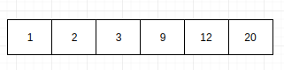

# Дерева


## Впорядкований масив


### Впорядкований масив

- Знайти елемент на пизиція i
- Знайти елемент з ключом k
- Знайти елемент більший за 20




## Дерево


### Дерево
**Дерево** - одна з найбільш широко поширених структур даних в інформатиці, емулююча деревоподібну структуру у вигляді набору пов'язаних вузлів. Є зв'язаним графом, що не містить цикли. Більшість джерел також додають умова на те, що ребра графа не повинні бути орієнтованими. На додаток до цих трьох обмеженням, в деяких джерелах вказується, що ребра графа не повинні бути зваженими.


### Дерево


### Дерево


### Дерево
- Кореневий вузол - самий верхній вузол дерева (вузол 8 на прикладі).
- Корінь - одна з вершин, за бажанням спостерігача.
- Лист, листовий або термінальний вузол - вузол, який не має дочірніх елементів (вузли 1, 4, 7, 13).
- Внутрішній вузол - будь-який вузол дерева, що має нащадків, і таким чином, не є листовим вузлом (3, 6, 10, 14)


### Представлення дерева в пам'яті


## Бінарне дерево пошуку


### Бінарне дерево пошуку
Бінарне дерево пошуку будується за певними правилами:
- У кожного вузла не більше двох дітей.
- Будь-яке значення менше значення вузла стає лівою дитиною або дитиною лівого дитини.
- Будь-яке значення більше або дорівнює значенню вузла стає правою дитиною або дитиною правої дитини.


### Бінарне дерево пошуку


Зверніть увагу, як зазначені обмеження впливають на структуру дерева. Кожне значення зліва від кореня (8) менше восьми, кожне значення праворуч - більше або дорівнює кореню. Це правило застосовується до будь-якого вузла дерева.


### Пошук в бінарному дереві


### Пошук в бінарному дереві
```py
Node search(x : Node, k : T):
   if x == null or k == x.key
      return x
   if k < x.key
      return search(x.left, k)
   else
      return search(x.right, k)
```


### Пошук мінімального і максимального значення
Щоб знайти мінімальний елемент в бінарному дереві пошуку, необхідно просто дотримуватися left від кореня дерева, поки не зустрінеться значення null. Якщо у вершини є ліве піддерево, то за властивістю бінарного дерева пошуку в ньому зберігаються всі елементи з меншим ключем. Якщо його немає, значить ця вершина і є мінімальна. Аналогічно шукається і максимальний елемент. Для цього потрібно слідувати правим вказівниками.


### Пошук мінімального і максимального значення
```py
Node minimum(x : Node):
  if x.left == null
     return x
  return minimum(x.left)
```


### Пошук мінімального і максимального значення
```py
Node maximum(x : Node):
  if x.right == null
     return x
  return maximum(x.right)
```


### Пошук мінімального і максимального значення
Дані функції приймають корінь поддерева, і повертають мінімальний (максимальний) елемент в поддереве. Обидві процедури виконуються за час O(h).


### Додавання вузла
Додавання вузла не представляє особливої ​​складності. Воно стає ще простіше, якщо вирішувати цю задачу рекурсивно. Є всього два випадки, які треба врахувати:


### Додавання вузла
- Дерево пусте

Якщо дерево порожнє, ми просто створюємо новий вузол і додаємо його в дерево.


### Додавання вузла
- Дерево не пусте

У другому випадку ми порівнюємо передане значення зі значенням в вузлі, починаючи від кореня. Якщо додається значення менше значення даного вузла, повторюємо ту ж процедуру для лівого піддерева. В іншому випадку - для правого.


### Видалення вузла
Для видалення вузла з бінарного дерева пошуку потрібно розглянути три можливі ситуації:


### Видалення вузла
- Якщо у вузла немає дочірніх вузлів, то у його батька потрібно просто замінити покажчик на null


### Видалення вузла
- Якщо у вузла є тільки один дочірній вузол, то потрібно створити новий зв'язок між батьком видаляється вузла і його дочірнім вузлом.


### Видалення вузла
- якщо у вузла два дочірніх вузла, то потрібно знайти наступний за ним елемент (у цього елемента не буде лівого нащадка), його правого нащадка підвісити на місце знайденого елемента, а видаляється вузол замінити знайденим вузлом.


## Необхідність балансування дерева


### Необхідність балансування дерева
Збалансоване бінарне дерево пошуку застосовується, коли необхідно здійснювати швидкий пошук елементів, що чергується зі вставками нових елементів і вилученнями існуючих. У разі, якщо набір елементів, що зберігається в структурі даних фіксований і немає нових вставок і вилучень, то масив краще. Тому що пошук можна здійснювати алгоритмом бінарного пошуку за той же логарифмічна час, але відсутні додаткові витрати по зберіганню і використанню покажчиків.


### Необхідність балансування дерева


### Необхідність балансування дерева
Користі від такого дерева - зовсім небагато. В даному випадку, нам потрібна структура, яка в разі додавання елементів - буде балансувати сама себе, але при цьому зберігати вид двійкового дерева пошуку.


## АВЛ - дерева


### АВЛ - дерева


## Красно - чорні збалансовані дерева


### Красно - чорні збалансовані дерева


## AVL vs Red Black tree


### AVL vs Red Black tree


