# Черга із пріорітетом


## Що таке черга із пріорітетом?


### Що таке черга із пріорітетом?
**Черга з пріоритетом** (англ. Priority queue) - абстрактний тип даних в програмуванні, що підтримує дві обов'язкові операції - додати елемент і отримати максимум (мінімум). Передбачається, що для кожного елемента можна обчислити його пріоритет - дійсне число або в загальному випадку елемент лінійно впорядкованої множини.


### Що таке черга із пріорітетом?
Основні методи, які реалізуються чергою з пріоритетом, такі:

- insert (ключ, значення) - додає пару (ключ, значення) в сховище;
- extract_maximum () - повертає пару (ключ, значення) з мінімальним значенням ключа, видаляючи її з сховища.


### Що таке черга із пріорітетом?
На практиці інтерфейс черзі з пріоритетом нерідко розширюють іншими операціями:
- findMin или findMax — пошук елемента із найбільшим пріорітетом
- deleteMin(), deleteMax(), deleteKey() - видалення елемента із певним пріорітетом
- increaseKey або decreaseKey - оновити значення елемента


### Що таке черга із пріорітетом?
Приклади застосування черги із пріорітетом:
- Планувальник задач передачі даних:
Максимально можливу кількість черг чотири: High, Medium, Normal, Low. Планувальник починає обслуговування з більш пріоритетною черзі High. Якщо в її черги більше немає очікують пакетів, то він переходить до наступної менш пріоритетною черзі в якій є очікують пакети. Після кожного обслуговування черг Medium, Normal або Low планувальник повертається до черги High, тобто процес повторюється. Низько-пріоритетна чергу Low обслуговується тільки коли в чергах High, Medium, Normal немає очікують пакетів.


## Наївні реалізації черги із пріорітетом


### Наївні реалізації черги із пріорітетом
||Insert|ExtractMax|
|-|-|-|
|Масив/список|$O(1)$|$O(n)$|
|Упорядкований масив/список|O(n)|O(1)|


## Двійкова куча


### Двійкова куча
Двійкова куча, піраміда, або сортувальне дерево - таке бінарне дерево, для якого виконані три умови:

- Значення в будь-якій вершині не менш, ніж значення її нащадків.

Існують також кучі, де значення в будь-якій вершині, навпаки, не більше, ніж значення її нащадків. Такі купи називаються min-heap, а кучі, описані вище - max-heap.


### Двійкова куча


### GetMax
Реалізація **GetMax** просто повертає корінь дерева. Операція GetMax працює за $O(1)$


### Insert
**Алгоритм додавання**:
- Підвісити нову вершину до листа, або до вершини в якої один син.
- Просіяти вверх


### Insert
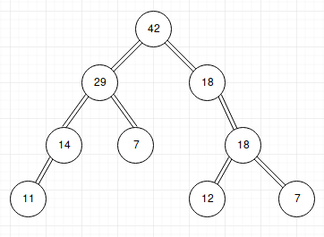


### Insert
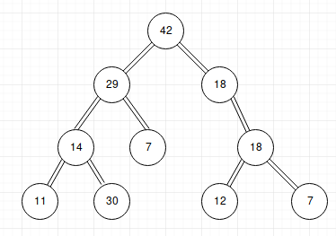


### Insert
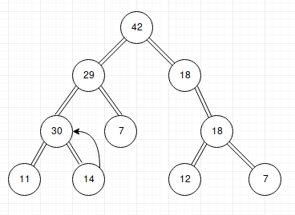


### Insert
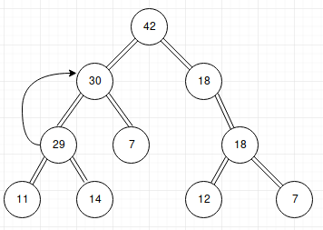


### Insert
Асимптотична складність вставки $O(h)$, де h - висота дерева.


### ExtractMax
Алгоритм **ExtractMax**:
- Обміняти корінь із листом
- Просіяти вниз

> При просіюванні вниз, є два шляхи ліве і праве під-дерево. Просіювати краще із значенням, яке більше.


### ExtractMax
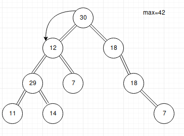


### ExtractMax
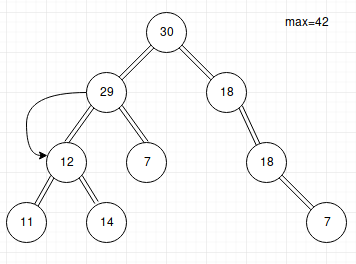


### ExtractMax
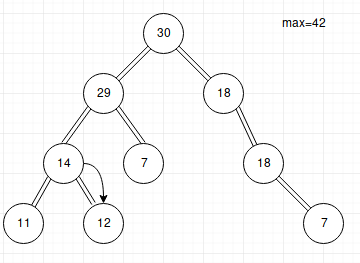


### ExtractMax
Асимптотична складність ExtractMax $O(h)$, де h - висота дерева.


### ChangePriority
Алгоритм **ChangePriority**:
- Змінити пріорітет
- Запустити процедуру просіювання вниз/вверх

> Якщо пріорітет понизився, то просіюємо вниз, якщо збільнився - вверх.


### ChangePriority
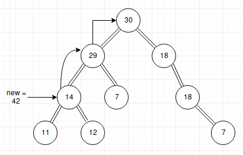


### ChangePriority
Асимптотична складність ExtractMax $O(h)$, де h - висота дерева.


### Remove
**Алгоритм Remove**:
- Змінити пріорітет на "бескінечність", або дуже велике число відповідно до контексту.
- Просіяти вверх
- Викликати операцію ExtractMax

Асимптотична складність ExtractMax $O(h)$, де h - висота дерева.


## Повністю заповнена двійкова куча


### Повністю заповнена двійкова куча
На повністю заповнену куча накладаються наступні умови:
- Глибина всього листя (відстань до кореня) відрізняється не більше ніж на 1 шар.
- Останній шар заповнюється зліва направо без «дірок».


### Повністю заповнена двійкова куча
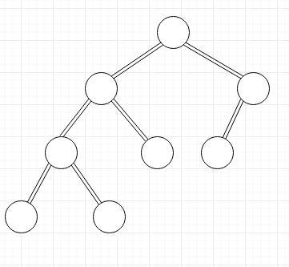


### Повністю заповнена двійкова куча
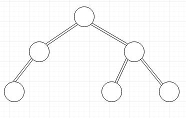


### Повністю заповнена двійкова куча
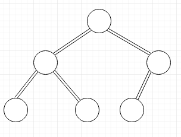


### Повністю заповнена двійкова куча
Навіщо дерево повинно бути повністю заповнене:
1. Швидкість операцій(Асомптотична складність операцій на такому дереві буде $O(logn)$)


### Повністю заповнена двійкова куча
2. Зручно зберігати в місиві
> В зележності від необхідності обходу в реалізаціях потрібно пам'ятати посилання на батька і/або дочірніх нодів.

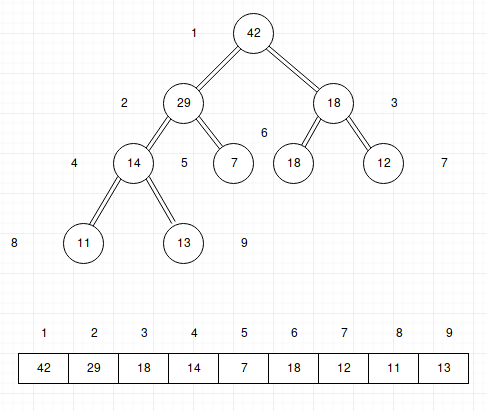


### Повністю заповнена двійкова куча
```
PARENT(i) = [i/2]
LEFTCHILD(i) = 2i
RIGHTCHILD(i) = 2i+1
```

> При реалізації потрібно враховувати вихід за рамки масива.

Складність таких операцій $O(1)$


## Як  підтримувати дерево повністю заповненим?


### Як  підтримувати дерево повністю заповненим?
Операції, які можуть зламити повністю заповнене дерево:
- Insert
- ExtractMax
Всі інші операції або не змінюються структуру дерева, або викликають операції Insert, ExtractMax


### Insert
Додавати вершини потрібно додавати вузол на пусте ліве місце:

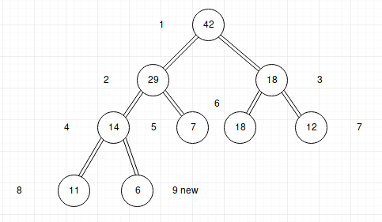


### ExtractMax
При обміні із корня із листом потрібно змінювати на крайній лівий лист:

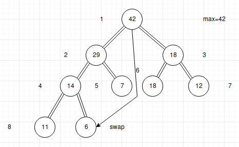


## Реалізація двійкової кучі


### Реалізація двійкової кучі
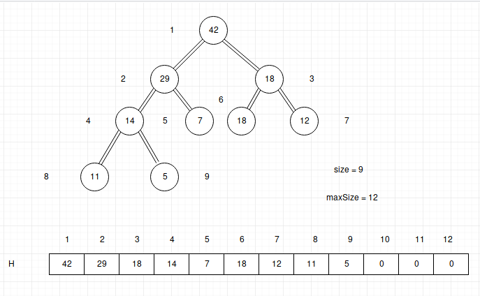


### Реалізація двійкової кучі
**Функції знаходження дочірніх і батьківських елементів**:

```
PARENT(i):
    return [i/2]

LEFTCHILD(i):
    return 2i

RIGHTCHILD(i)
    return 2i+1
```


### Реалізація двійкової кучі
**Функції просіювання**:

```
SHIFTUP(i):
    while i > 1 and H[PARENT(i)] < H[i]
    swap H[PARENT(i)] and H[i]
    i:=PARENT(i)
```

```
SHIFTDOWN(i):
    maxIndex:=i
    l:=LEFTCHILD(i)
    if l <= size and H[l] > H[maxIndex]:
        maxIndex:=l
    r:=RIGHTCHILD(i)
    if r <= size and H[r] > H[maxIndex]:
        maxIndex:=r
    if i!=maxIndex:
        swap H[i] and H[maxIndex]
        SHIFTDOWN(maxIndex)
```


### Реалізація двійкової кучі
**Функція вставки**:

```
INSERT(p):
    if size=maxSize:
        return ERROR
    size:=size+1
    H[size]:=p
    SHIFTUP(size)
```


### Реалізація двійкової кучі
**Функція повернення максимума**:

```
EXTRACTMAX():
    result:=H[1]
    H[1]:=H[size]
    size:=size-1
    SHIFTDOWN(1)
    return result
```


### Реалізація двійкової кучі
**Функція видалення**:

```
REMOVE(i):
    H[i]:=10000000
    SHIFTUP(i)
    EXTRACTMAX
```


### Реалізація двійкової кучі
**Функція зміни пріорітета**:

```
CHENGEPRIORITY(i,p):
    oldp:=H[i]
    H[i]:=p
    if p>oldp:
        SHIFTUP(i)
    else:
        SHIFTDOWN(i)
```


### Індексація масива з 0
```
parent(i)=[i-1/2]
left(i)=2i+1
right(i)=2i+2
```


### Переваги двійкової кучі

- Швидко
- Компактно
- Легко реалізувати


## d - арна куча


### d - арна куча
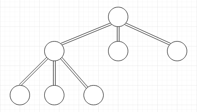


### d - арна куча
**Асимптотичні складності**:
- Висота $log_d n$
- SHIFTUP $O(log_d n)$
- SHIFTDOWN $O(d log_d n)$


## Пірамідальне сортування(Heap sort)


### Пірамідальне сортування(Heap sort)
Алгоритм пірамідального сортування:
1. Додати елементи в кучу
2. Вийняти елементи із кучі


### Пірамідальне сортування(Heap sort)
```
HEAPSORT(A[1..n]):
    for i from 1 to n:
        INSERT(A[i])
    for i from n downto 1;
        A[i]:=EXTRACTMAX()
```


### Пірамідальне сортування(Heap sort)
Асимптотична складність: $O(nlogn) + o(nlogn) = max(O(nlogn),O(nlogn)) = O(nlogn)$

**Пірамідальне сортування в в даній реалізації потребує n додаткової пам'яті**


### Пірамідальне сортування без перевиділення пам'яті
Як перетворити масив в кучу?:

```
BUILDHEAP(A[1..n]):
    size:=n
    for i from [n/2] downto 1:
        SHIFTDOWN(i)
```
```
HEAPSORT(A[1..n]):
    BUILDHEAP(A)
    repeat (n-1) times:
        swap A[1] and A[size]
        size:=size-1
        SHIFTDOWN(1)
```


### Пірамідальне сортування без перевиділення пам'яті
Асимптотична складність BUILDHEAP $O(n * 1/2 * logn) = O(nlogn)$


### Переваги і недоліки heap sort
Переваги:
- Має доведену оцінку гіршого випадку $O(nlog n)$.
- Сортує на місці, тобто вимагає всього $O(1)$ додаткової пам'яті

Heap sort активно використовується в ядрі [лінукс](https://elixir.bootlin.com/linux/latest/source/lib/sort.c)


### Переваги і недоліки heap sort
Недостатки:

- Нестійкий
- На майже відсортованих масивах працює так само довго, як і на хаотичних даних.
- На одному кроці вибірку доводиться робити хаотично по всій довжині масиву - тому алгоритм погано поєднується з кешуванням і підкачкою пам'яті.
- Методу потрібно «миттєвий» прямий доступ; не працює на пов'язаних списках і інших структурах пам'яті послідовного доступу.


## STL priority_queue


### STL priority_queue
**Пріорітетна черга(STL priority_queue)** - це тип контейнерних адаптерів, спеціально розроблених таким чином, що перший елемент черги є найбільшим з усіх елементів у черзі, а інші елементи знаходяться в порядку зменшення (отже, ми бачимо, що кожен елемент черги має пріоритет фіксованого порядку).


### STL priority_queue
```cpp
template<
    class T,
    class Container = std::vector<T>,
    class Compare = std::less<typename Container::value_type>
> class priority_queue;
```


### STL priority_queue
**Інтерфейс**:
- priority_queue::empty() in C++ STL– empty() function returns whether the queue is empty.
- priority_queue::size() in C++ STL– size() function returns the size of the queue.
- priority_queue::top() in C++ STL– Returns a reference to the top most element of the queue
- priority_queue::push() in C++ STL– push(g) function adds the element ‘g’ at the end of the queue.
- priority_queue::pop() in C++ STL– pop() function deletes the first element of the queue.
- priority_queue::swap() in C++ STL– This function is used to swap the contents of one priority queue with another priority queue of same type and size.


### STL priority_queue
**Приклад №1**
```cpp
std::priority_queue<int> q;
 
for(int n : {1,8,5,6,3,4,0,9,7,2})
    q.push(n);
```


### STL priority_queue
**Приклад №2**
```cpp
std::priority_queue&lt;int, std::vector&lt;int&gt;, std::greater&lt;int&gt; &gt; q2;
 
for(int n : {1,8,5,6,3,4,0,9,7,2})
    q2.push(n);
```
