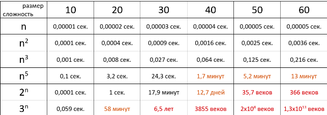
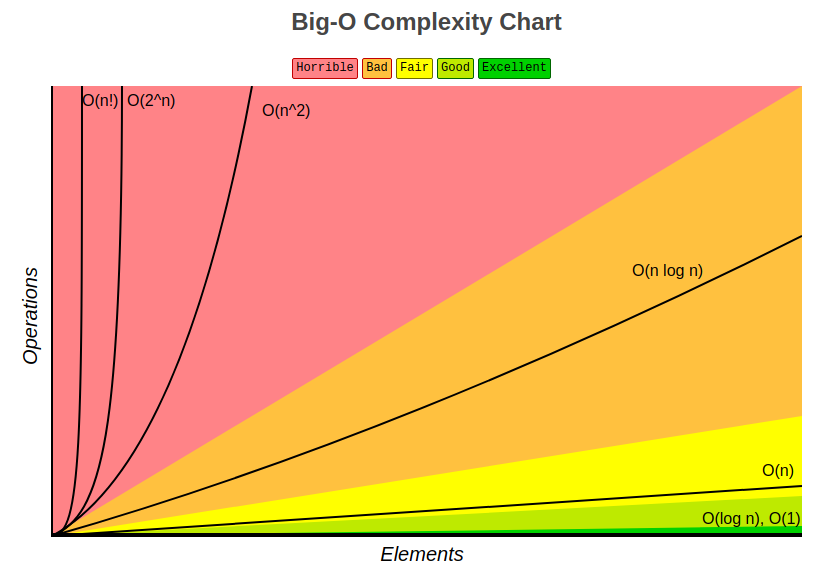
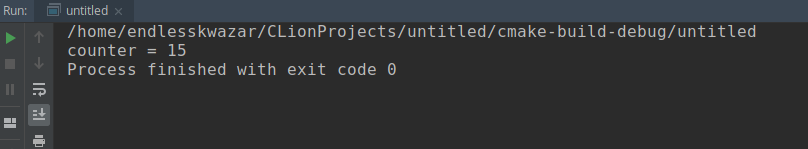
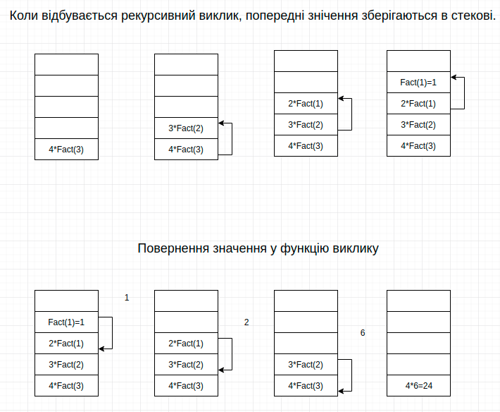

# Оцінка складності алгоритмів

${toc}

# Що таке теорія алгоритмів і навіщо її вивчати?

**Теорія алгоритмів** - наука, що знаходиться на стику математики та інформатики, що вивчає загальні властивості і закономірності алгоритмів і різноманітні формальні моделі їх подання.

Глибокі знання алгоритмів програмісту потрібно в двох випадках:
- Він хоче працювати в Google, Amazon, Microsoft ібо інші пафосні місця з великою кількістю бажаючих
- Він буде працювати розробником цих самих алгоритмів: картографія, трейдинг, машинне навчання, розробка движка ігор.

Базові ж знання алгоритмів допоможуть:
- Не вирішувати задачу, якщо її рішення вже давно існує.
- Вибирати ефективне рішення з множини варіантів

# Що таке алгоритм? Властивості алгоритму.

**Алгоритм** - набір команд, які необхідно виконати для вирішення задачі.

Погодьтесь визначення доволі просте, що можи навести на думку, що розробка алгоритмів не є складним процесом. Але на практиці, алгоритми пишуться для вирішення складних задач.

Щоб зрозуміти роботу алгоритму не досить розглянути його кроки. Потрібно ще визначити декілька важливих моментів.

- **Поведінка алгоритму.** Чи знаходить алгоритм найкращий із можливих рішень, чи просто хороше. Якому рішенню потрібно віддати перевагу.
- **Швидкість алгоритму.** Швидкий алгоритм чи ні? Чи є вхідні дані, які зменшуть швидкість виконання?
- **Вимоги до пам'яті.** Скільки алгоритму потрібно ресурсів для вирішення поставленої задачі? Чи є цей об'єм ресурсів прийнятним?

Хороший алгоритм повинен бути правильним, надійним і ефективним. Якщо він не справляється із поставленою задачею від нього мало толку. Якщо алгоритм не є надійним, його використання стає небезпечним. Хороший код повинен бути простим. Для будь-якого алгоритму повинні виконуватися наступні властивості:

- **дискретність** - алгоритм складається з окремих послідовних кроків
- **збіжність** (закынченнысть, результативність) - алгоритм завжди закінчується за кінцеве число кроків
- **визначеність** (детермінованість) - будь-який крок алгоритму повинен бути однозначно визначений і зрозумілий виконавцю
- **масовість** - алгоритм повинен бути вірний для будь-яких даних, що належать одному класу.

# Як оцінити швидкість алгоритму?

Давайте напишемо алгоритм і вирахуємо скільки часу він виконується:

```cpp
#include <iostream>
#include <chrono>

using namespace std;

int main (int argc, char **argv)
{
    int arr[] = {4,8,1,6,7};

    //c++11 time library
    auto start = chrono::steady_clock::now();

    int min = arr[0];
    for(int i = 1; i < 5; i++){
        if(min > arr[i]){
            min = arr[i];
        }
    }
    auto end = chrono::steady_clock::now();
    auto diff = end - start;

    cout << "Min element = " << min << endl;
    cout << "Time: " << chrono::duration <double, milli> (diff).count() << " ms" << endl;
}
```

Зафіксуємо час до виконання і після виконання коду і вирахуємо різницю. Ця різниця і буде часом виконання алгоритму.

Які є проблеми такого способу оцінки часу виконання алгоритму?:
- Вирахуваний час відноситься лише до конкретних вхідних даних і їх кількості. Що буде, якщо кількість вхідних даних виросте на порядок?
- Час виконання був вуирахований на певній машині із деякими характеристиками. Що буде, якщо цей алгоритм виконуватиметься на іншій машині із іншою конфігурацією?

На практиці, точний час мало кого цікавить: він залежить від процесора, типу даних, мови програмування і безлічі інших параметрів. Важлива лише **асимптотична складність**, тобто. складність при прагненні розміру вхідних даних до нескінченності.

# Асимптотична складність.

Припустимо, певним алгоритмом потрібно виконати $4n^3+7n$ умовних операцій, щоб обробити n елементів вхідних даних. При збільшенні n на підсумкове час роботи буде значно більше впливати піднесення n в куб, ніж множення його на 4 або ж додавання 7n. Тоді кажуть, що складність цього алгоритму дорівнює $O(n^3)$, тобто, залежить від розміру вхідних даних кубічно.

У асимптотичному аналізі, складність алгоритму - це функція, що дозволяє визначити, як швидко збільшується час роботи алгоритму зі збільшенням обсягу даних.

Оцінюючи порядок складності алгоритму, необхідно використовувати тільки ту частину, яка зростає найшвидше.

## Приклад оцінки складності алгоритму №1

Давайте оціним складність наступного коду:

```cpp
#include <iostream>

using namespace std;

template <class T> T min(T arr[], int size){
    T min = arr[0];

    for(int i = 1; i < size; i++){
        if(min > arr[i]){
            min = arr[i];
        }
    }

    return min;
}

int main (int argc, char **argv)
{
    const int size = 10;
    int arr[] = {4,8,1,6,7,6,2,3,9,0};

    int min_in_arr = min(arr,size);

    cout << "Min element = " << min_in_arr << endl;
}
```

Тут нас цікавить лише функція min:

```cpp
template <class T> T min(T arr[], int size){
    T min = arr[0];

    for(int i = 1; i < size; i++){
        if(min > arr[i]){
            min = arr[i];
        }
    }

    return min;
}
```

1. Присвоюємо змінній min значення arr[0] - $O(1)$
2. Цикл for який виконає size(n) ітерацій - $O(n)$
3. Трудомісткість кожної ітерації не залежить від кількості елементів масиву, тому має складність - $O(1)$
4. Повернення значення min - $O(1)$

$O(1) + O(n) * O(1) + O(1) = O(1 + n * 1 + 1) = O(n)$

Отже, складність даного алгоритму $O(n)$.

## Приклад оцінки складності алгоритму №2

Давайте оцінимо складність наступного алгоритму:

```cpp
template <class T> void max(T** arr, int rows, int cols){

    for(int i = 0; i < rows; i++){
        T max = arr[i][0];
        for(int j = 0; j < cols; j++){
            if(max < arr[i,j]){
                max = arr[i][j];
            }
        }
        cout << "Max element in row " << i << ":" << max << endl;
    }
}
```

У цьому алгоритмі змінна i змінюється від 1 до N. При кожній зміні i, змінна j теж змінюється від 1 до N. Під час кожної з N ітерацій зовнішнього циклу, внутрішній цикл теж виконується N раз. Загальна кількість ітерацій внутрішнього циклу одно N * N. Це визначає складність алгоритму $O(N^2)$.

## Правила оцінки складності алгоритму

**Правило суми**:
Нехай $T_1(n)$ і $T_2(n)$ - час виконання 2-х програмних фрагментів $P_1$ i $P_2$. $T_1(n)$ - має складність $O(f(n))$, а $T_2(n)$ - $O(g(n))$. Тоді час послідовного виконання двох фрагментів $P_1$ i $P_2$ має складність $O(max(O(f(n))),O(g(n)))$. Найчастіше дане правило використовується для оцінки часу виконання послідовності операторів. 

**Час базових операцій**
Час виконання операторів присвоювання, читання і записи зазвичай має порядок $O(1)$.

**Цикли**. Час виконання циклів обчислюється, як добуток кількості виконаних ітерацій циклу на найбільше можливе час операторів тіла циклу.

**Винесення константного множника**. $O(k*f)=O(f)$ - постійний множник k (константа) відкидається, оскільки з ростом обсягу даних, його сенс втрачається, наприклад:
$O(9,1n) = O(n)$

**Множиння двох функцій**. $O(f*g)= O(f) * O(g)$ - оцінка складності твори двох функцій дорівнює добутку їх складнощів, наприклад:
$O(5n*n) = O(5n)*O(n) = O(n)*O(n) = O(n*n) = O(n^2)$

**Ділення двох функцій**. $O(f/g) = O(f)/O(g)$ - оцінка складності ділення двох функцій дорівнює діленню їх складнощів, наприклад:
$O(5n/n) = O(5n)/O(n) = O(n)/O(n) = O(n/n) = O(1)$


## Базові складності, які можна зустріти

### Константна

$O(1)$ - константна складність

Трапляється, що час роботи алгоритму взагалі не залежить від розміру вхідних даних. Тоді складність позначають як O (1). Наприклад, для визначення значення третього елемента масиву не потрібно ні запам'ятовувати елементи, ні проходити по ним скільки-то раз. Завжди потрібно просто дочекатися в потоці вхідних даних третій елемент і це буде результатом, на обчислення якого для будь-якої кількості даних потрібно одне і той же час.

### Лінійна

$O(n)$ — лінійна складність.

Такий складністю володіє, наприклад, алгоритм пошуку найбільшого елемента в не відсортованому масиві. Нам доведеться пройтися по всіх n елементів масиву, щоб зрозуміти, який з них максимальний.

### Логарифмічна

$O(log {}n)$ - логарифмічна складність.

Найпростіший приклад - бінарний пошук. Якщо масив відсортований, ми можемо перевірити, чи є в ньому якесь конкретне значення, шляхом розподілу навпіл. Перевіримо середній елемент, якщо він більше шуканого, то відкинемо другу половину масиву - там його точно немає. Якщо ж менше, то навпаки - відкинемо початкову половину. І так будемо продовжувати ділити навпіл, в результаті перевіримо log n елементів.

### Квадратична

$O(n^2)$ - квадратична складність.

Таку складність має, наприклад, алгоритм сортування вставками. У канонічної реалізації він вдає із себе два вкладених циклу: один, щоб проходити по всьому масиву, а другий, щоб знаходити місце чергового елементу в уже відсортованої частини. Таким чином, кількість операцій буде залежати від розміру масиву як n * n, тобто  $N^2$.

### Порівняння складностей

Час виконання алгоритму з певною складністю в залежності від розміру вхідних даних при швидкості $10^6$ операцій в секунду:



### Графік асимпотичних складностей




# Оцінка складності рекурсивного алгоритму

Нагадаємо, що рекурсивними процедурами називаються процедури, які викликають самі себе. Їх складність визначити досить важко. Складність цих алгоритмів залежить не тільки від складності внутрішніх процедур, а й від кількості ітерацій рекурсії. Рекурсивна процедура може виглядати досить просто, але вона може серйозно ускладнити програму, багаторазово викликаючи себе.

## Проста рекурсія

Розглянемо рекурсивную реалізацію обчислення факторіала:

```cpp
#include <iostream>

using namespace std;

int factorial(int number){
    if(number < 0)
        return 0;
    if(number == 0)
        return 1;
    return number * factorial(number - 1);
}

int main (int argc, char **argv)
{
    int a = 3;
    cout << "Factorial " << a << "=" <<factorial(a);
}
```

Ця процедура виконується N раз, таким чином, обчислювальна складність цього алгоритму дорівнює $O(N)$.

## Багатократна рекурсія

Рекурсивний алгоритм, який викликає себе кілька разів, називається багаторазової рекурсією. Такі процедури набагато складніше аналізувати, крім того, вони можуть зробити алгоритм набагато складніше.

Розглянемо таку процедуру:
```cpp
#include <iostream>

using namespace std;

void double_rec(int number){
   if(number < 0)
       return;
   double_rec(number - 1);
   double_rec(number - 1);
}

int main (int argc, char **argv)
{
    int a = 3;
    double_rec(a);
}
```

Оскільки процедура викликається двічі, можна було б припустити, що її робочий цикл буде дорівнює $O(2N) = O(N)$. Але насправді ситуація набагато складніша.

Давайте модифікуємо код і подивимося скільки насправді виконується функція:

```cpp
#include <iostream>

using namespace std;

int counter = 0;

void double_rec(int number){
   if(number < 0)
       return;
   ++counter;
   double_rec(number - 1);
   double_rec(number - 1);
}

int main (int argc, char **argv)
{
    int a = 3;
    double_rec(a);
    cout << "counter = " << counter;
}
```



Якщо уважно дослідити цей алгоритм, то стане очевидно, що його складність дорівнює $O(2^{N+1}-1) = O(2^N)$. Завжди треба пам'ятати, що аналіз складності рекурсивних алгоритмів нетривіальне завдання.


## Пам'ять при рекурсивних алгоритмах

Для всіх рекурсивних алгоритмів дуже важливо поняття об'ємної складності. При кожному виклику процедура запитує невеликий обсяг пам'яті, але цей обсяг може значно збільшуватися в процесі рекурсивних викликів. З цієї причини завжди необхідно проводити хоча б поверхневий аналіз об'ємної складності рекурсивних процедур.




# Середній і найгірший випадок

Оцінка складності алгоритму до порядку є верхньою межею складності алгоритмів. Якщо програма має великий порядок складності, це зовсім не означає, що алгоритм буде виконуватися дійсно довго. На деяких наборах даних виконання алгоритму займає набагато менше часу, ніж можна припустити на основі їх складності. Наприклад розглянемо випадком, коли алгоритм шукає певний елемент послідовно, проходячи по всіх.

Якщо шуканий елемент знаходиться в кінці списку, то програмі доведеться виконати N кроків. В такому випадку складність алгоритму складе $O(N)$. У цьому **найгіршому випадку** час роботи алгоритму будемо максимальним.

З іншого боку, шуканий елемент може знаходиться в списку на першій позиції. Алгоритмом доведеться зробити всього один крок. Такий випадок називається **найкращим** і його складність можна оцінити, як $O(1)$.
Обидва ці випадки малоймовірні. Нас найбільше цікавить очікуваний варіант. Якщо елементи списку спочатку безладно змішані, то шуканий елемент може виявитися в будь-якому місці списку. В **середньому** потрібно зробити N/2 порівнянь, щоб знайти потрібний об'єкт. Значить складність цього алгоритму в середньому становить $O(\frac{N}{2}) = O(N)$.

В даному випадку середня і очікувана складність збігаються, але для багатьох алгоритмів найгірший випадок сильно відрізняється від очікуваного.

## Ємнісна оцінка складності алгоритму

**Ємнісна складність** - це обсяг пам'яті, який потрібно алгоритму для отримання результату. Цей обсяг включає пам'ять для зберігання вхідних і вихідних значень, а також всіх проміжних обчислень.

На відміну від складності, вираз для $S(n)$ можна знайти досить легко. У більшості алгоритмів $S(n)=O(cn)$ де c - константа. Випадки, в яких $S(n)$ є експонентою або поліномом високого ступеня, зазвичай пов'язані з неправильним формулюванням або реалізацією алгоритму (наприклад, розрахувати і зберегти всі перестановки довжини n).

Для часової і ємнісної складності існує очевидне співвідношення: $S(n) <= T(n)$. Дійсно, щоб просто заповнити змінних, потрібно виконати, принаймні, стільки ж операцій. Але якщо виключити з розгляду підготовку або попередню обробку вихідних даних, то трудомісткість алгоритму може виявитися нижче його ємнісної складності. Наприклад, для алгоритму пошуку значення в упорядкованому масиві довжини без урахування витрат на сортування $T(n) = O(log n)$


# Пам'ять або час

Існує кілька способів вимірювання складності алгоритму. Програмісти зазвичай зосереджують увагу на швидкості алгоритму, але не менш важливі й інші показники - вимоги до обсягу пам'яті, вільного місці на диску. Використання швидкого алгоритму не приведе до очікуваних результатів, якщо для його роботи знадобиться більше пам'яті, ніж є у комп'ютера.

Багато алгоритми пропонують вибір між обсягом пам'яті і швидкістю. Завдання можна вирішити швидко, використовую великий обсяг пам'яті, або повільніше, займаючи менший обсяг.
Типовим прикладом в даному випадку служить алгоритм пошуку найкоротшого шляху. Представивши карту міста у вигляді мережі, можна написати алгоритм для визначення найкоротшої відстані між двома будь-якими точками цієї мережі. Щоб не обчислювати ці відстані щоразу, коли вони нам потрібні, ми можемо вивести найкоротші відстані між усіма точками і зберегти результати в таблиці. Коли нам знадобиться дізнатися найкоротша відстань між двома заданими точками, ми можемо просто взяти готове відстань з таблиці.
Результат буде отриманий миттєво, але це зажадає величезного обсягу пам'яті. Карта великого міста може містити десятки тисяч точок. Тоді, описана вище таблиця, повинна містити більше 10 млрд. Осередків. Тобто для того, щоб підвищити швидкодію алгоритму, необхідно використовувати додаткові 10 Гб пам'яті.
З цієї залежності виникає ідея об'ємно-часової складності. При такому підході алгоритм оцінюється, як з точки зорі швидкості виконання, так і з точки зору спожитої пам'яті.
Ми будемо приділяти основну увагу тимчасової складності, але, тим не менш, обов'язково будемо оскаржувати і обсяг споживаної пам'яті.

# Домашнє завдання

## Варіанти

1. Розробіть алгоритм пошуку найменшого елемента на головній діагоналі матриці. Порахуйте складність розробленого алгоритму.
2. Розробіть алгоритм, який обчислює суму головної діагоналі матриці. Порахуйте складність розробленого алгоритму.
3. Розробіть алгоритм, який переміщає місцями рядки і стовпці квадратної матриці. Порахуйте складність розробленого алгоритму.
4. Розробіть алгоритм, який перевіряє чи є дана матриця симетричною. Порахуйте складність розробленого алгоритму.
5. Розробіть алгоритм, який знаходить максимальний елемент у всій матриці. Порахуйте складність розробленого алгоритму.
6. Розробіть алгоритм, який знаходить мінімальний елемент у всій матриці. Порахуйте складність розробленого алгоритму.
7. Розробіть алгоритм, який обчислює суму всіх елементів матриці. Порахуйте складність розробленого алгоритму.
8. Розробіть алгоритм, який замінює від'ємний елемент на модуль цього елемента. Порахуйте складність розробленого алгоритму.
9. Розробіть алгоритм, який перевіряє чи є на головній діагоналі матриці від'ємні елементи. Порахуйте складність розробленого алгоритму.
10. Розробіть алгоритм, який перевіряє чи всі числа на головній діагоналі матриці є одинаковими. Порахуйте складність розробленого алгоритму.

# Контрольні запитання

1. Що таке алгоритм? Перелічіть основні властивості алгоритмів.
2. Що таке асимптотична складність алгоритмів?
3. Перелічіть основні правила при знаходженні асимптотичної складності алгоритму.
4. Як порахувати складність рекурсивних алгоритмів? Як рекурсивні алгоритми можуть вплинути на пам'ять?
5. Що таке ємнісна оцінка складності алгоритмів?