# Базові структури даних

# Зміст

${toc}

# Що таке структура даних

**Структура даних** (англ. Data structure) - програмна одиниця, що дозволяє зберігати і обробляти безліч однотипних і, або логічно пов'язаних даних в обчислювальній техніці. Для додавання, пошуку, зміни і видалення даних структура даних надає певний набір функцій, з яких складається інтерфейс.

# Масив

**Масив** - це область пам'яті, де можуть послідовно зберігатися кілька значень.


- Масив надає константий доступ по індексу
- Мисив в пам'яті зберігається безперервно
- Масив має фіксований розмір, після ініціалізаії(виділення)

## Аналіз складності додавання елементу в масив

**Додавання елементу в в кінець масиву** займає константиний час O(1). 


Для того щоб додати елемент в початок або в довільне місце доведеться потратити O(n), тому що нам доведеться здвигати n елементів для того щоб звільнити місце під новий елемент:

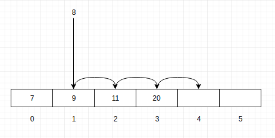

## Аналіз складності видалення елементу із масиву

**Видалення елементу із кінця масиву** відбувається за констаний час - O(1). За адресою останнього елемента його можна видалити. Навіть, необов'язково затирати останній елемент, можна просто ставити до нового дійсного розміру масива як до size - 1

Для того щоб видалити елемент з початку або довільного місця доведеться виконати O(n) операцій. Саме видалення елемента константе, але після його видалення в масиві з'явиться дира:

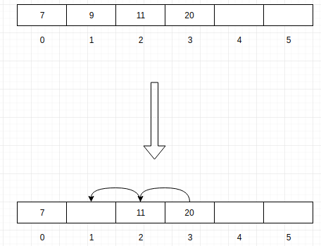

## Асимптотичні складності операцій з масивом

||Додавання|Видалення|
|-|-|-|
|Початок|O(n)|O(n)|
|Кінець|O(1)|O(1)|
|Середина|O(n)|O(n)|


# Динамічний масив

Динамічним називається масив, розмір якого може змінюватися під час виконання програми. Можливість зміни розміру відрізняє динамічний масив від статичного, розмір якого задається на момент компіляції програми. Для зміни розміру динамічного масиву мову програмування, що підтримує такі масиви, повинен надавати вбудовану функцію або оператор. Динамічні масиви дають можливість більш гнучкої роботи з даними, так як дозволяють не прогнозувати збережені обсяги даних, а регулювати розмір масиву відповідно до реально необхідними обсягами.

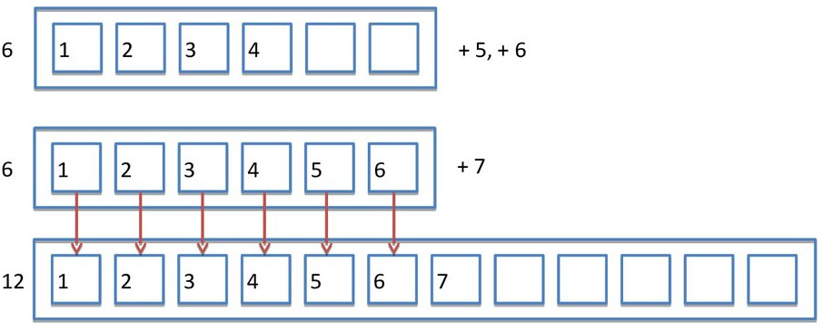

Для масивів з можливістю динамічної зміни розміру при реалізації доводиться знаходити «золоту середину» між кількома суперечливими вимогами:

- Ефективність по пам'яті - реалізація не повинна приводити до істотного перевитрати пам'яті.
- Ефективність по продуктивності, яка включає в себе:
  - мінімальні накладні витрати на зміну розміру масиву;
  - збереження, по можливості, константного часу доступу на читання / запис до елементів масиву.
- Сумісність зі звичайними статичними масивами на низькому рівні. Наприклад, необхідною умовою для застосування динамічного масиву у викликах функцій API операційної системи може бути обов'язкове розміщення елементів масиву в безперервному блоці фізичної оперативної пам'яті в порядку, відповідному індексації масиву. Якщо така вимога не виконується, динамічні масиви виявиться неможливо використовувати в поєднанні з низькорівневим кодом.

Залежно від пріоритету тих чи інших вимог вибирається відповідає їм спосіб реалізації.
m
Динамічні масиви можуть підтримуватися або на рівні синтаксису самої мови програмування, або на рівні системних бібліотек.

```cpp
int *mas = (int*)malloc(sizeof(int) * n);
...
mas = (int*)realloc(mas, sizeof(int) * m); // Зміна розміру з m на n із збереженням вмісту масиву
...
free(mas); 
```

Незручність такого підходу полягає в необхідності обчислювати розміри виділеної пам'яті, застосовувати явне перетворення типу і ретельно відслідковувати час життя масиву (як і завжди при роботі з динамічно виділеною пам'яттю в Сі).

При реалізації динамічного масиву потрібно розглянути два способи збулішення розміру нового масиву:

- Аддитивний. Перевиділення па'яті пов'язане із додаванням константи до даного розміру масиву
- Мультиплікативний. Перевиділення пам'яті пов'язане із множенням на контсанту даного розміру масиву


## Реалізація динамічного масиву на C++

```cpp
#include <iostream>
#include <cstring>

using namespace std;

enum scaling_factor_algs{add, mul};

template <class T>
struct dynamic_array{
private:
    int init_capacity = 8; //первоначальний розмір
    int scaling_factor = 2; //коефіцієнт збільшення масиву
    int length = 0; //дійсний розмір(індекс останнього елементу)
    int current_capacity = init_capacity; //розмір виділеного масиву
    scaling_factor_algs scaling_alg = scaling_factor_algs::mul; //алгоритм перевиділення
    T* arr;
    void resize_array();
    bool is_full();
    void init_array();
public:
    dynamic_array(){init_array();};
    dynamic_array(
            int inti_capacity,
            int scaling_factor,
            scaling_factor_algs scaling_alg
            ) : init_capacity(init_capacity),
                scaling_factor(scaling_factor),
                scaling_alg(scaling_alg){init_array();};
    int get_length();
    bool is_empty();
    int get_Capacity();
    T add_element(T element);
    T get_element_at(int index);
};

template<class T> void dynamic_array<T>::init_array() {
    arr = new T[init_capacity];
}

template<class T> bool dynamic_array<T>::is_full() {
    if(length == current_capacity)
        return true;
    return false;
}

template<class T> int dynamic_array<T>::get_Capacity() {
    return current_capacity;
}

template<class T> T dynamic_array<T>::get_element_at(int index) {
    if(index > length)
        cerr << "Provided index higher than current length";
    if(index < 0)
        cerr << "Index cannot be less than zero";
    return arr[index];
}

template <class T> int dynamic_array<T>::get_length() {
    return length;
}

template<class T> void dynamic_array<T>::resize_array() {
    //створюємо новий масив більшого розміру
    T* new_arr;
    if(scaling_alg == scaling_factor_algs::add){
        int new_capacity = length + scaling_factor;
        current_capacity = new_capacity;
        new_arr = new T[new_capacity];
    }
    if(scaling_alg == scaling_factor_algs::mul){
        int new_capacity = length * scaling_factor;
        current_capacity = new_capacity;
        new_arr = new T[new_capacity];
    }

    //Копіюємо старі дані в новий масив
    //Функція std::memcpy в <cstring>
    memcpy(new_arr, arr, length);

    //Видаляємо старий масив і працюємо із новим
    delete[] arr;
    arr = new_arr;


    clog << "Array was resized. " << "Current capacity: " << current_capacity << endl;
}

template<class T> T dynamic_array<T>::add_element(T element) {
    arr[++length] = element;
    if(is_full())
        resize_array();
    return element;
}

template<class T> bool dynamic_array<T>::is_empty() {
    return (length == 0) ? true : false;
}


int main (int argc, char **argv)
{
    dynamic_array<int>* arr = new dynamic_array<int>();

    for(int i = 0; i < 2500; i++){
        arr->add_element(i);
    }
}
```

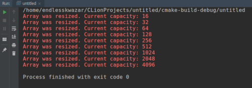

## std::vector

В стандартній бібліотеці C ++ є поліпшена версія динамічних масивів, більш безпечна і зручна - std :: vector.

На відміну від std :: array, який недалеко відходить від базової функціональності звичайних фіксованих масивів, std :: vector йде в комплекті з додатковими можливостями, які роблять його одним з найбільш корисних і універсальних інструментів в C ++.

Представлений в C ++ 03, std :: vector (або просто вектор) - це той же динамічний масив, але який може сам керувати виділеної собі пам'яттю. Це означає, що ви можете створювати масиви, довжина яких задається під час виконання, без використання операторів new і delete (явного вказівки виділення і звільнення пам'яті). std :: vector знаходиться в заголовки &lt;vector&gt;.

Детально про std::vector можна почитати на [cppreference](https://ru.cppreference.com/w/cpp/container/vector) ми ж розглянемо лише базові навики роботи з std::vector.

Оголошення std::vector наступні:

```cpp

#include <vector>
 
// немає необхідності вказувати довжину при ініціалізації
std :: vector <int> array;
std :: vector <int> array2 = {10, 8, 6, 4, 2, 1}; // використовується список ініціалізаторів для ініціалізації масиву
std :: vector <int> array3 {10, 8, 6, 4, 2, 1}; // використовується uniform ініціалізація для ініціалізації масиву (починаючи з C ++ 11)
```

Зверніть увагу, що і в неініціалізованих, що і в Ініціалізувати випадках вам не потрібно явно вказувати довжину array. Це пов'язано з тим, що std :: vector динамічно виділяє пам'ять для свого вмісту за запитом.

Подібно std :: array, доступ до елементів масиву може виконуватися як через оператор [] (який не виконує перевірку діапазону), так і через функцію at () (яка виконує перевірку діапазону):

```cpp
array [7] = 3; // без перевірки діапазону
array.at (8) = 4; // з перевіркою діапазону
```

У будь-якому випадку, якщо ви будете запитувати елемент, який виходить за допустимі array, розмір вектора автоматично мінятися не буде.

Починаючи з C ++ 11, ви також можете присвоювати значення std :: vector використовуючи список ініціалізаторів:

```cpp
array = {0, 2, 4, 5, 7}; // добре, довжина array тепер 5
array = {11, 9, 5}; // добре, довжина array тепер 3
```

### std::vector і memory leek

Коли змінна-вектор виходить з області видимості, вона автоматично звільняє пам'ять, яку контролювала (займала). Це не тільки зручно (так як вам не потрібно це робити вручну), але також допомагає запобігти витоку пам'яті. Розглянемо наступний фрагмент:

```cpp
void doSomething (bool value)
{
    int * array = new int [7] {12, 10, 8, 6, 4, 2, 1};
 
    if (value)
        return;
 
   // робимо що-небудь
 
    delete [] array; // ніколи не виконається
}
```

Якщо value задати значення true, то array ніколи не буде віддалятися, пам'ять ніколи не буде звільнятися і станеться витік пам'яті.

Однак, якби array був вектором, то подібне ніколи б не сталося, так як пам'ять звільнялася б автоматично, як тільки array вийшов би з області видимості (незалежно від того, чи вийде функція раніше з області видимості чи ні). Саме через це використання std :: vector є більш безпечним, ніж динамічне виділення пам'яті через оператор new.

### Довжина вектора

На відміну від стандартних динамічних масивів, які не знають свою довжину, std :: vector свою довжину запам'ятовує. Щоб її дізнатися - потрібно використовувати функцію size ():

```cpp
#include <vector>
#include <iostream>
 
int main ()
{
    std :: vector <int> array {12, 10, 8, 6, 4, 2, 1};
    std :: cout << "The length is:" << array.size () << '\ n';
 
    return 0;
}
```

### Зміна розміру вектора

Змінити розмір стандартного динамічно виділеного масиву досить проблематично і складно. Змінити розмір std :: vector так само просто, як викликати функцію resize ():

```cpp
#include <vector>
#include <iostream>
 
int main ()
{
    std :: vector <int> array {0, 1, 2};
    array.resize (7); // змінюємо довжину array на 7
 
    std :: cout << "The length is:" << array.size () << '\ n';
 
    for (auto const & element: array)
        std :: cout << element << '';
 
    return 0;
}
```

Тут є дві речі, на які слід звернути увагу. По-перше, коли ми змінили розмір array, існуючі значення елементів збереглися! По-друге, нові елементи були ініційовані значенням за замовчуванням в відповідно до визначеного типу даних (значенням 0 в типі int).

Розмір вектора також можна змінити і в зворотний бік (обрізати):

```cpp
#include <vector>
#include <iostream>
 
int main ()
{
    std :: vector <int> array {0, 1, 4, 7, 9, 11};
    array.resize (4); // змінюємо довжину array на 4
 
    std :: cout << "The length is:" << array.size () << '\ n';
 
    for (auto const & element: array)
        std :: cout << element << '';
 
    return 0;
}
```

# Списки

**Зв'язаний список** - базова динамічна структура даних в інформатиці, що складається з вузлів, кожен з яких містить як власне дані, так і одну або дві посилання ( «зв'язки») на наступний і, або попередній вузол списку. Важлива перевага перед масивом є структурна гнучкість: порядок елементів зв'язкового списку може не збігатися з порядком розташування елементів даних в пам'яті комп'ютера, а порядок обходу списку завжди явно задається його внутрішніми зв'язками.

## Однозв'язний список

Кожен вузол ононаправленого (однозв'язного) лінійного списку містить одне поле покажчика на наступний вузол. Поле покажчика останнього вузла містить нульове значення (вказує на NULL або TAIL).

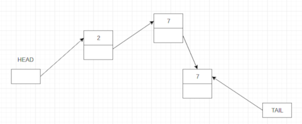

Давйте опустимо елементи HEAD і TAIL, а також те що крім даних ми зберігаємо ше і показчик на наступний елемент. Хоча, не будемо забувати про їх існування.

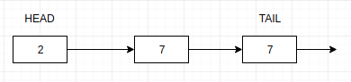

### Додавання елементу в список

**Вставка в кінець** списку виконується за $O(1)$:

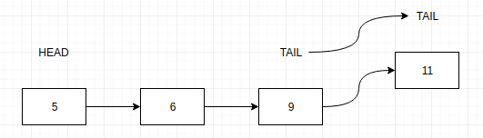

**Вставка в початок** списку теж доволі проста операція, яка виконується за константний час:

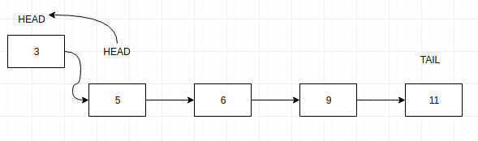

Під **вставкой в середину** ми розуміємо вставку після, якогось елементу або до. 

Якщо розглядати **вставку після якогось елементу** це робиться за константний час:

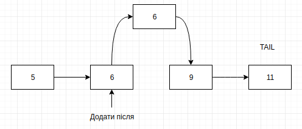

Якщо нам потрібно **додати елемент перед даним**, то нам потрібно потратити $O(n)$ для того, щоб знайти елент в спискові в якого показчик веде на даний елемент.

### Видалення елементу із списка

**Видалення із початку** виконується за $O(1)$:

\

**Видалення із кінця** займе $O(n)$. Тому що доведеться пройти весь список, щоб знайти елемент показчик, якого посилається на TAIL.

**Видалення із середини** буде працювати за $O(n)$, зновуж таки ми не знаємо попередній елемент, і щоб його знайти доведеться проходити по спискові.

### Реалізація однозв'язного списку на C++

```cpp
#include <iostream>
using namespace std;
struct Node {
    int data;
    struct Node *next;
};
struct Node* head = NULL;
void insert(int new_data) {
    struct Node* new_node = (struct Node*) malloc(sizeof(struct Node));
    new_node->data = new_data;
    new_node->next = head;
    head = new_node;
}
void display() {
    struct Node* ptr;
    ptr = head;
    while (ptr != NULL) {
        cout<< ptr->data <<" ";
        ptr = ptr->next;
    }
}
int main() {
    insert(3);
    insert(1);
    insert(7);
    insert(2);
    insert(9);
    cout<<"The linked list is: ";
    display();
    return 0;
}
```

### std::forward_list

**Forward list** - контейнер, що надає механізм вставки і видалення елементів з контейнера. Швидкий довільний доступ не підтримується. Реалізований у вигляді односпрямованого списку.

Базовий інтерфейс:
|Метод|Пояснення|
|-|-|
|front()|Доступ до першого елемента|
|empty()|Перевіряє наявність елементів|
|clear()|Очищення контейнера|
|insert_after()|Вставка після елементу|
|push_front()|Додає елемент в початок списку|
|pop_front()|Видаляє елемент із початку списку|

і багато інших - [cppreference](https://ru.cppreference.com/w/cpp/container/forward_list)

```cpp
#include <iostream>
#include <forward_list>
 
int main()
{
    std::forward_list<int> numbers = { 1, 2, 3, 4, 5 };
 
    int first = numbers.front();    // 1
 
    for (int n : numbers)
        std::cout << n << "\t";
    std::cout << std::endl;
    return 0;
}
```

## Двохзв'язний список

Кожен вузол двонаправленого (двохзвёязного) лінійного списку містить два поля покажчиків - на наступний і на попередній вузли. Покажчик на попередній вузол кореня списку містить нульове значення. Покажчик на наступний вузол останнього вузла також містить нульове значення.


### Порівняльний аналіз асимптотичних складностей операцій одно і двохзв'язного списку

Оскільки двохзв'язний список зберігає показчик як на попередній так і на наступний елемент, всі операції на основі нього виконуються за $O(1)$

||Однозв'язний|Двохзв'язний|
|-|-|-|
|Вставка в початок|$O(1)$|$O(1)$|
|Вставка в кінець|$O(1)$|$O(1)$|
|Вставка в середину|$O(n)$|$O(1)$|
|Видалення із початку|$O(1)$|$O(1)$|
|Видалення із кінця|$O(n)$|$O(1)$|
|Видалення із середини|$O(n)$|$O(1)$|
|Доступ до елемента|$O(n)$|$O(n)$|
|Пошук|$O(n)$|$O(n)$|

### std::list

std::list являє собою контейнер, який підтримує швидку вставку і видалення елементів з будь-якої позиції в контейнері. Швидкий довільний доступ не підтримується. Він реалізований у вигляді двусвязного списку. На відміну від std :: forward_list цей контейнер забезпечує можливість двонаправленого ітерування, будучи при цьому менш ефективним щодо використовуваної пам'яті.


# Стек

Стек - це колекція, елементи якої отримуються за принципом «останній увійшов, перший вийшов» (Last-In-First-Out або LIFO). Це означає, що ми будемо мати доступ тільки до останнього доданому елементу.

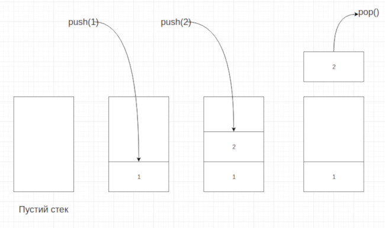

Стек - це абстрактна структура даних, яка характеризується наступним інтерфейсом:

- **empty** - перевірка на наявність елементів
- **push** - додавання елементу на вершину стека
- **pop** - повернення і видалення елементу із вершини стека
- peek - отримання елементу із стека, але без видалення
- count - кількість елементів в стекові

Де використовується структура даних - Стек:

- Для зберігання переданих параметрів у функцію
- Для рекурсивних викликів
- Для виконання програмних операції((A+B)*(C+D))

## Як представляти стек?

### На масиві

Перед реалізацією стека виділимо ключові поля:
- s[1...n] - масив, який здатен вмістити не більше n - елементів
- s.top - індекс останнього елемента в масиві

Стек складається з елементів s [1 ... s.top], де s [1] - елемент на дні стека, а s [s.top] - елемент на його вершині. Якщо s.top = 0, то стек не містить жодного елемента і є порожнім.

### На динамічному масиві

Можлива реалізація стека на динамічному масиві, в результаті чого з'являється істотна перевага над звичайною реалізацією: при операції push ми ніколи не зможемо вийти за межі масиву, тим самим уникнемо помилки виконання.

### З використанням списку

Стек можна реалізувати і на списку. Для цього необхідно створити список і операції роботи стека на створеному списку. Нижче представлений приклад стека на однозв'язного списку.


## Реалізація Стека на C++

```cpp
#include <iostream>
using namespace std; 
int stack[100], n=100, top=-1;
void push(int val) {
   if(top>=n-1)
      cout << "Stack Overflow" << endl; 
   else {
      top++;
      stack[top]=val;
   }
}
void pop() {
   if(top<=-1)
      cout << "Stack Underflow" << endl;
   else {
      cout << "The popped element is " << stack[top] << endl;
      top--;
   }
}
```

## std::stack

Клас є контейнером-адаптером, що дає програмісту функціональність стека - зокрема, FILO (First In Last Out - перший увійшов, останній вийшов) структури даних.

Базовий інтерфейс:
|Метод|Пояснення|
|-|-|
|top()|Доступ до вершини стека без його видалення|
|empty()|Перевіряє наявність елементів|
|push()|Додає елемент на вершину стека|
|pop()|Повертає і видаляє елемент із вершини стека|
|push_front()|Додає елемент в початок списку|
|pop_front()|Видаляє елемент із початку списку|

```cpp
#include <iostream> 
#include <stack> 
using namespace std; 
  
void showstack(stack &lt;int&gt; s) 
{ 
    while (!s.empty()) 
    { 
        cout << '\t' << s.top(); 
        s.pop(); 
    } 
    cout << '\n'; 
} 
  
int main () 
{ 
    stack &lt;int&gt; s; 
    s.push(10); 
    s.push(30); 
    s.push(20); 
    s.push(5); 
    s.push(1); 
  
    cout << "The stack is : "; 
    showstack(s); 
  
    cout << "\ns.size() : " << s.size(); 
    cout << "\ns.top() : " << s.top(); 
  
  
    cout << "\ns.pop() : "; 
    s.pop(); 
    showstack(s); 
  
    return 0; 
} 
```


## Знаходження макимального/мінімального елементу в стекові за константний час

Підтримувати мінімальний або максимальний елемент в стекові можна за допомогою іншого стека, який буде зберігати відповідно мінімальне або максимальне значення при додаванні елементу:


Псевдо-код даного підходу:

```
Процедура getMax:
    повернути S2.pop()

Прооцедура push(x):
    Якщо S1 порожній
        S1.push(x)
        S2.push(x)
    Інакше
        Якщо x > S2.top()
            S1.push(x)
            S2.push(S2.top())
        Інакше
            S1.push(x)
            S2.push(x)
```

# Черга

Черга (англ. queue) в програмуванні — динамічна структура даних, що працює за принципом «перший прийшов — перший пішов» (англ. FIFO — first in, first out).


Основні операції із чергою:
- **enqueue** — "поставити в чергу". Операція додавання елемента в "хвіст" черги. При цьому довжина черги збільшується на одиницю. Якщо відбувається намагання додати елемент у вже заповнену чергу, відбувається її переповнення (англ. queue overflow).
- **dequeue** — "отримання з черги". Операція, яка повертає елемент з голови та видаляє його з черги, таким чином встановлюючи голову на наступний за видаленим елемент та зменшуючи довжину на одиницю. При намаганні видалити елемент з пустої черги, виникає ситуація "незаповнення" (англ. queue underflow).

## Реалізація Черги

### Релізація на масиві

Перший спосіб являє чергу у вигляді масиву і двох цілочисельних змінних start і end.


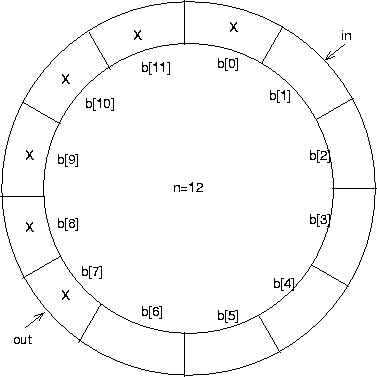

Зазвичай start вказує на голову черги, end - на елемент, який заповниться, коли в чергу увійде новий елемент. При додаванні елемента в чергу в q[end] записується новий елемент черги, а end зменшується на одиницю. Якщо значення end стає менше 1, то ми як би циклічно обходимо масив, і значення змінної стає рівним n. Витяг елемента з черги проводиться аналогічно: після вилучення елемента q[start] з черги змінна start зменшується на 1. З такими алгоритмами одна осередок з n завжди буде незайнятої (так як черга з n елементами неможливо відрізнити від порожньої), що компенсується простотою алгоритмів.

**Переваги даного методу**: можлива незначна економія пам'яті в порівнянні із списками; простіше в розробці.

**Недоліки**: максимальна кількість елементів в черзі обмежена розміром масиву. При його переповненні потрібно перевиделення пам'яті і копіювання всіх елементів в новий масив.

### Реалізація на спискові

Другий спосіб заснований на роботі з динамічною пам'яттю. Черга представляється як лінійний список, в якому додавання / видалення елементів йде строго з відповідних його кінців.

**Переваги даного методу**: розмір черги обмежений лише обсягом пам'яті.

**Недоліки**: складніше в розробці; потрібно більше пам'яті; при роботі з такою чергою пам'ять сильніше фрагментируется; робота з чергою дещо повільніше.

### Реалізація на двох стеках

Методи черзі можуть бути реалізовані на основі двох стеків $S_1$ і $S_2$, як показано нижче:

```
Процедура enqueue (x):
    S1.push (x)

Функція dequeue ():
    якщо S2 порожній:
        якщо S1 порожній:
            повідомити про помилку: черга порожня
        поки S1 не пустили:
            S2.push (S1.pop ())
    повернути S2.pop ()
```


Такий спосіб реалізації найбільш зручний в якості основи для побудови персистентной черзі

## std:queue

Клас **std::queue** є контейнерним адаптером, який дає програмісту функціональність черги - зокрема, FIFO (першим увійшов, першим вийшов) структуру даних.

Базовий інтерфейс:
|Метод|Пояснення|
|-|-|
|front()|Доступ першого елементу|
|back()|предоставляє доступ до останнього елемента|
|empty()|Перевіряє наявність елементів|
|pop()|Повертає і видаляє перший елемент|
|push()|Вставляє елемент в кінець|

```cpp
#include <iostream> 
#include <queue> 
  
using namespace std; 
  
void showq(queue &lt;int&gt; gq) 
{ 
    queue &lt;int&gt; g = gq; 
    while (!g.empty()) 
    { 
        cout << '\t' << g.front(); 
        g.pop(); 
    } 
    cout << '\n'; 
} 
  
int main() 
{ 
    queue &lt;int&gt; gquiz; 
    gquiz.push(10); 
    gquiz.push(20); 
    gquiz.push(30); 
  
    cout << "The queue gquiz is : "; 
    showq(gquiz); 
  
    cout << "\ngquiz.size() : " << gquiz.size(); 
    cout << "\ngquiz.front() : " << gquiz.front(); 
    cout << "\ngquiz.back() : " << gquiz.back(); 
  
    cout << "\ngquiz.pop() : "; 
    gquiz.pop(); 
    showq(gquiz); 
  
    return 0; 
} 
```


# Домашнє завдання

Запропонуйте реалізацію двохзв'язного списку або черги на ваш вибір. Порахуйте складність операцій. Порахуйте ємнісну складність.

# Контрольні запитання

1. Що таке структура даних?
2. Як працює масив. Які переваги цієї структури даних?
3. Поясніть такі структури даних як однозв'язний і двохзв'язний список.
4. Що таке Стек. Наведіть приклад використання Стека.
5. Поясныть структуру даних - Черга. Як можна реалызувати Чергу?