# Огляд базових алгоритмів

${toc}

# Важливі задачі

# Сортування

**Завдання сортування** (sorting problem) полягає в впорядкування заданого списку будь-яких елементів в порядку зростання.

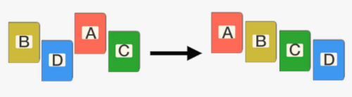

## Властивості алгоритмів сортування

Алгоритми сортування можуть мати деякі властивості:
- **Стійкість**
- **Природність поведінки**
- **Використання операції порівняння**

**Стійкість** (англ. Stability) - стійка сортування не змінює взаємного розташування елементів з однаковими ключами.

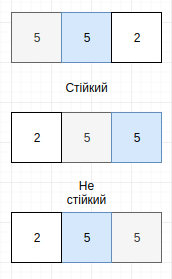

**Природність поведінки** - ефективність методу при обробці вже упорядкованих або частково впорядкованих даних. Алгоритм поводиться природно, якщо враховує цю характеристику вхідної послідовності і працює краще.

**Використання операції порівняння**. Алгоритми, що використовують для сортування порівняння елементів між собою, називаються заснованими на порівняннях. Мінімальна трудомісткість гіршого випадку для цих алгоритмів становить $O(nlogn)$, але вони відрізняються гнучкістю застосування. Для спеціальних випадків (типів даних) існують більш ефективні алгоритми.

## 

## Алгоритм швидкого сортування (Quick sort)

**Швидке сортування**, сортування Хоара (англ. Quicksort), часто звана qsort (по імені в стандартній бібліотеці мови Сі) - широко відомий алгоритм сортування, розроблений англійським інформатики Чарльзом Хоаром під час його роботи в МДУ в 1960 році.

Один з найшвидших відомих універсальних алгоритмів сортування масивів: в середньому $O(n*log n)$ обмінів при сортуванны n елементів; через наявність ряду недоліків на практиці зазвичай використовується з деякими доробками.

Загальна ідея алгоритму полягає в наступному:

- Вибирається з масиву елемент, який називається опорним. Це може бути будь-який з елементів масиву. Від вибору опорного елемента не залежить коректність алгоритму, але в окремих випадках може сильно вплинути на ефективність.
- Порівняти всі інші елементи з опорним і переставити їх у масиві так, щоб розбити масив на три безперервних відрізка, наступні один за одним: «менші опорного», «рівні» і «великі».
- Для відрізків «менших» і «великих» значень виконати рекурсивно ту ж послідовність операцій, якщо довжина відрізка більше одиниці.
  
На практиці масив зазвичай ділять не на три, а на дві частини: наприклад, «менші опорного» та «рівні і великі»; такий підхід в загальному випадку ефективніше, так як спрощує алгоритм поділу.

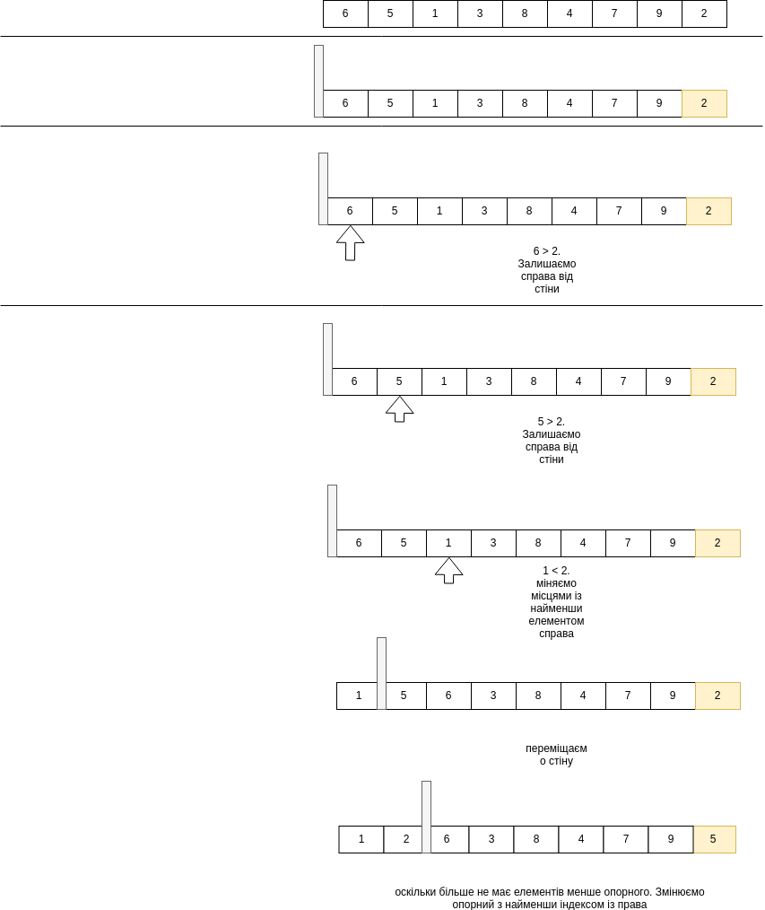

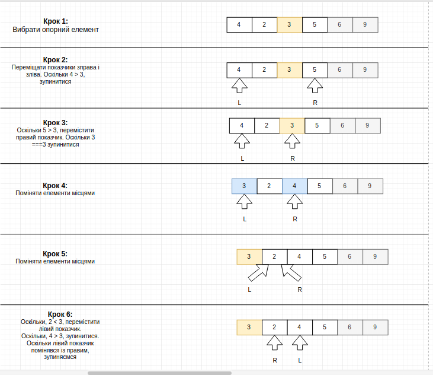

```
 algorithm quicksort(A, lo, hi) is
    if lo < hi then
        p := partition(A, lo, hi)
        quicksort(A, lo, p - 1)
        quicksort(A, p + 1, hi)
```

**Вибір опорного елемента**: У ранніх реалізаціях, як правило, опорним вибирався перший елемент, що знижувало продуктивності на відсортованих масивах. Для поліпшення ефективності може вибиратися середній, випадковий елемент або (для великих масивів) медіана першого, середнього і останнього елементів.


### Переваги і недоліки алгоритму швидкого сортування

**Переваги**:
- Один з найбільш швидкодіючих (на практиці) з алгоритмів внутрішнього сортування загального призначення.
- Простий в реалізації.
- Вимагає лише $O(log n)$ додаткової пам'яті для своєї роботи. (Не покращений рекурсивний алгоритм в гіршому випадку $O(n)$ пам'яті
- Добре поєднується з механізмами кешування і віртуальної пам'яті.
- Допускає природне розпаралелювання (сортування виділених подмассивов в паралельно виконуються підпроцесами).
- Працює на зв'язкових списках і інших структурах з послідовним доступом, що допускають ефективний прохід як від початку до кінця, так і від кінця до початку.

**Недоліки**:
- Сильно деградує по швидкості $O(n^2)$ в гіршому або близькому до нього випадку, що може трапитися при невдалих вхідних даних.
- Пряма реалізація у вигляді функції з двома рекурсивними викликами може привести до помилки переповнення стека, так як в гіршому випадку їй може знадобитися зробити O(n) вкладених рекурсивних викликів.
- Нестійкий.

## Merge Sort

**Сортування злиттям** (англ. merge sort) — алгоритм сортування, в основі якого лежить принцип «Розділяй та володарюй»(важлива парадигма розробки алгоритмів, що полягає в рекурсивному розбитті розв'язуваної задачі на дві або більше підзадачі того ж типу, але меншого розміру, і комбінуванні їх розв'язків для отримання відповіді до вихідного завдання.). В основі цього способу сортування лежить злиття двох упорядкованих ділянок масиву в одну впорядковану ділянку іншого масиву. 

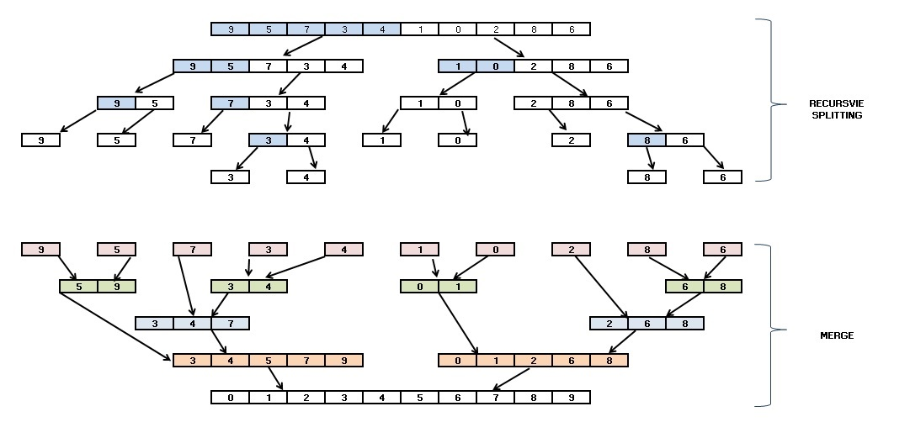


## Релізація Merge Sort на C++

```cpp
int * merge_sort (int * up, int * down, unsigned int left, unsigned int right)
{
    if (left == right)
    {
        down [left] = up [left];
        return down;
    }

    unsigned int middle = (left + right) / 2;

    // розділяй і володарюй
    int * l_buff = merge_sort (up, down, left, middle);
    int * r_buff = merge_sort (up, down, middle + 1, right);

    // злиття двох відсортованих половин
    int * target = l_buff == up? down: up;

    unsigned int l_cur = left, r_cur = middle + 1;
    for (unsigned int i = left; i <= right; i ++)
    {
        if (l_cur <= middle && r_cur <= right)
        {
            if (l_buff [l_cur] <r_buff [r_cur])
            {
                target [i] = l_buff [l_cur];
                l_cur ++;
            }
            else
            {
                target [i] = r_buff [r_cur];
                r_cur ++;
            }
        }
        else if (l_cur <= middle)
        {
            target [i] = l_buff [l_cur];
            l_cur ++;
        }
        else
        {
            target [i] = r_buff [r_cur];
            r_cur ++;
        }
    }
    return target;
}
```

## Переваги і недоліки алгоритму сортування злиттям

**Переваги**:
- Працює навіть на структурах даних послідовного доступу.
- Непогано працює в паралельному варіанті: легко розбити завдання між процесорами порівну, але важко зробити так, щоб інші процесори взяли на себе роботу, в разі якщо один процесор затримається.
- Стійка - зберігає порядок рівних елементів (що належать одному класу еквівалентності в порівнянні).

**Недоліки**:
- На «майже відсортованих» масивах працює так само довго, як на хаотичних.
- Вимагає додаткової пам'яті за розміром вихідного масиву.

## Merge Sort vs Quick Sort

**Швидкий сортування**, як правило, швидше, ніж сортування злиття, коли дані зберігаються в пам'яті. Однак, коли набір даних величезний і зберігається на зовнішніх пристроях, таких як жорсткий диск, сортування злиття є чітким переможцем з точки зору швидкості. Це зводить до мінімуму дорогі читання зовнішнього диска, а також добре підходить для паралельних обчислень.

## Асимптотичні складності алгоритмів сортування


# Пошук

**Завдання пошуку** полягаж в знаходженні заданого значення, яке називається **ключем пошуку** (search key), серед множини значень.

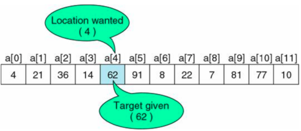

## Пошук у невідосортованому масиві

Слід зауважити, що якщо масив не впорядкований, то пошук неефективний.

### Лінійний пошук

Для знаходження деякого елемента (ключа) в заданому невідсортованому масиві використовується алгоритм лінійного (послідовного) пошуку. Він працює як з несортованими масивами, так і відсортованими, але для других існують алгоритми ефективніше лінійного пошуку.

Слово «лінійний» містить в собі основну ідею методу. Починаючи з першого, все елементи масиву послідовно проглядаються і порівнюються з шуканим. Якщо на якомусь етапі поточний елемент виявиться рівним шуканого, тоді елемент вважається знайденим, і як результат повертається номер цього елемента, або інша інформація про нього.

Нижче, на прикладі фігур, наочно демонструється робота алгоритму лінійного пошуку:

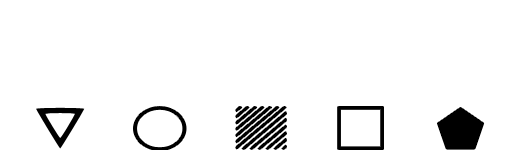

Реалізація алгоритму лінійного пошуку на C++:

```cpp
#include <iostream>

using namespace std;

template<class T> int linear_search(T arr[], T search_key, int size){
    for(int i = 0; i < size; i++){
        if(search_key == arr[i]){
            return i;
        }
    }
    return -1;
}

int main (int argc, char **argv)
{
    int size = 5;
    int arr[] = {7,5,4,9,1};
    int search_key = 4;

    int searched_item_index = linear_search(arr, search_key, size);

    if(searched_item_index == -1)
        cout << "Element " << search_key << " not found.";
    else
        cout << "Element " << search_key << " found at index " << searched_item_index;
}
```

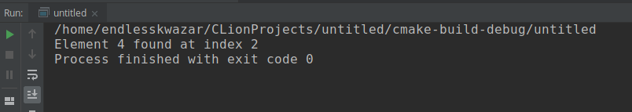

У найкращому випадку, коли шуканий елемент займає першу позицію, алгоритм зробить все одне порівняння, а в гіршому N, де N - кількість елементів в масиві. Найгіршому випадку відповідають дві ситуації: шуканий елемент займає останню позицію, або він зовсім відсутній в масиві.

Алгоритм лінійного пошуку не часто використовується на практиці, оскільки принцип роботи «в лоб» робить швидкість рішення їм завдання дуже низькою. Його застосування виправдане на невеликих або невідсортованих послідовності.

## Пошук у відсортованому масиві

Коли послідовність складається з великого числа елементів, і з нею треба працювати не раз,тоді найбільш оптимальним рішенням виявляється попередня сортування цієї послідовності з подальшим застосуванням бінарного або іншого, відмінного від лінійного, алгоритму пошуку.

### Бінарний пошук

Двійкóвий пóшук — алгоритм знаходження заданого значення у впорядкованому масиві, який полягає у порівнянні серединного елемента масиву з шуканим значенням, і повторенням алгоритму для тієї або іншої половини (див. двійкове дерево пошуку), залежно від результату порівняння.


Трудомісткість алгоритму $O(log(n))$, де n — кількість елементів у масиві.

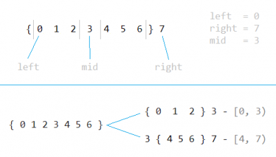

## Асимптотичні складності алгоритмів пошуку

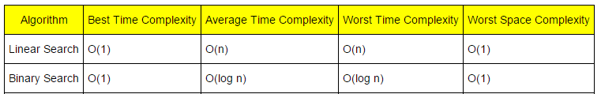

# Пошук підрядка в рядку

**Пошук підрядка в рядку** (англ. String searching algorithm) - клас алгоритмів над рядками, які дозволяють знайти патерн (pattern) в тексті (text).

У завданнях пошуку традиційно прийнято позначати шаблон пошуку як **needle** (з англ. - «голка»), а рядок, в якій ведеться пошук - як **haystack** (з англ. - «стіг сіна»).

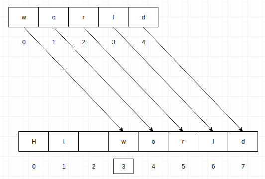

## Недієздатність "вирішення задачі в лоб"

- $|Σ|=σ$­ — розмір алфавіту
- $|text|=t$ — довжина тексту
- $|pattern|=p$ — довжина паттерна
- $a$ — розмір відповіді (к-ть пар)
- $m$ — сумарна довжина всіх паттернів

- Середній час - $O(p⋅(t−p))$
- Найгірший випадок $O(t^2)$

## Алгоритм Бойера-Мура-Хорспула

Дано масив **str** із N елементів і масив **pattern** із M елементів, причому $0 <= M < N$.

Описані вони так:
```cpp
char str[N];
char pattern[M]
```

Пошук підрядка знаходить перше входження pattern в str.

Етапи роботи алгоритму:
1. Формування таблиці d, яка використовується при зсуві підрядка в рядку.
2. Пошук підрядка в рядку

Порівняння символів начинається не з початку, а з кінця.

Ефективність алгоритму Бойера-Мура-Хорспула обумовлена тим, що вдається пропустити ті частини тексту, які заздалегіть не впливають на успішне знаходження.

**Перший етап - формування таблиці зміщення**:
Значення елемента таблиці d рівне відаленню відповідного символа строки ві кінця строки.

При чьому:
1. Якщо символ зустрічається більше одного разу, то використовується значення відповідного символу, який знаходиться найближче до кінця

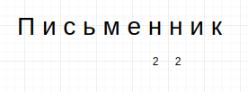

2. Множинне входження символів в строку ніяк не впливає на підрахунок символів від кінця строки

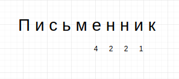

3. Якщо символ в кінці рядка зустрічається лише один раз, то йому відповідає значення довжини рядка

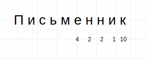

4. Якщо символ в кінці рядка зустрічається більше одного разу, то застосовується значення, яке найбільш близьке до останнього

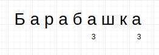

5. Для символів, які не присутні в рядку відаленість рівна довжині рядка

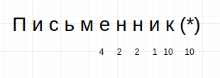

**Другий етап - пошук підрядка в рядку**:

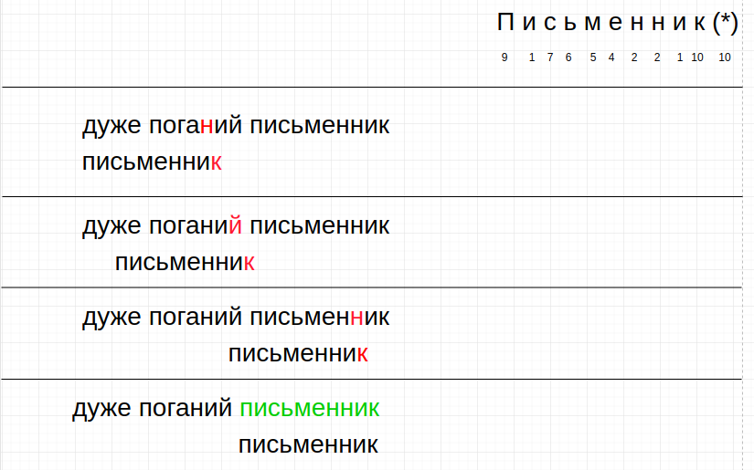

**Асимптотична складність алгоритму**:
В найгіршому випадку потрібно $O(m⋅n)$ порівнянь. де n довжина ісходного тексту, m - довжина шаблону.

**Переваги даного алгоритму:**
1. Дуже швидкий в середньому. Простий в реалізації. Використовує стандартну функцію порівняння ділянок пам'яті, як правило, оптимізовану на асемблерному рівні під конкретний процесор.

**Недоліки даного алгоритму:**
1. Як і інші алгоритми сімейства Бойера-Мура, що не модифікується на приблизний пошук, одночасний пошук кількох рядків.

# Домашнє завдання

## Варіанти

1. Релазуйте алгоритм Tim Sort
2. Релазуйте алгоритм Buble Sort
3. Релазуйте алгоритм Insertion Sort
4. Релазуйте алгоритм Selection Sort
5. Релазуйте алгоритм Counting Sort

# Контрольні запитання

1. Що собою являє задача сортування. Назвіть властивості алгоритмів сортування?
2. Назвіть різницю між Merge Sort і Quick Sort.
3. Як можна знайти елемент в невідсортованому масивові? Яка складність таких алгоритмів?
4. Які алгоритми можна застосувати для пошуку елемента в відсортованому масиві?
5. Що собою являє задача підрядка в рядку?