# Графи

# Зміст

${toc}

# Що таке граф?

**Граф** - сукупність точок, з'єднаних лініями. Точки називаються вершинами, або вузлами, а лінії - ребрами, або дугами.

- V - множина вершин
- E - множина ребер
- V: {1,2,3,4,5}
- E:{(1,2),(2,1),(3,3),(3,4),(4,5)}


# Де застосувуються графи?

- Маршрути

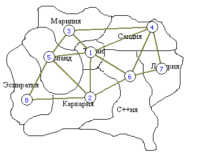

- Топологія мережі

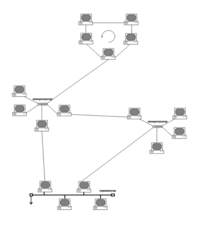

- Соціальний граф

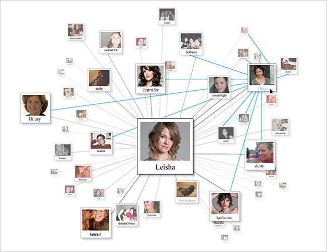

- В медицині

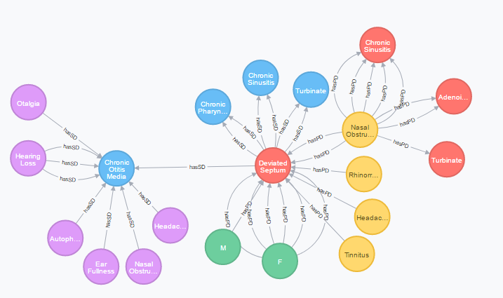

і т.д.

# Характеристики графів

Графи можуть характеризуватися наступними ознаками:
- Орієнтований / неорієнтований
- Наявність циклів
- Наявність петель
- Додаткова інформація
- Зв'язність
- Планарність

## Орієнтовані і неорієнтовані графи

Графи можуть бути **орієнтованими**, **неорієнтованимим** і **змішанимим**.

В **орієнтованому** графі ребра є спрямованими, тобто існує тільки однин доступний напрямок між двома зв'язковими вершинами.

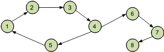

У **неорієнтованому** графі по кожному з ребер можна здійснити перехід в обох напрямках.


Різниця між орієнтованим і неорієнтованим графом:

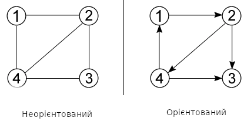

Окремий випадок двох цих видів - **змішаний граф**. Він характерний наявністю як орієнтованих, так і неорієнтовані ребер.

## Наявність циклів

Для того щоб розібратися із циклами в графах давайте введемо поняття шлях. **Шлях в графі** - це послідовність ребер, в якій кінець кожного ребра (крім останнього) збігається з початком наступного. Тоді, замкнутий шлях називається **циклом**.

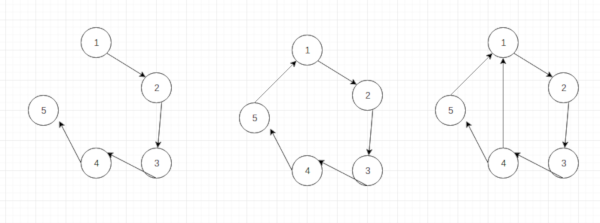

## Наявність петель

Коли у ребра обидва кінці збігаються, тобто воно виходить з вершини і входить в неї, то таке ребро називається **петлею**.


## Додаткова інформація

Грфа в своїх вершинах може містити складні структури даних.

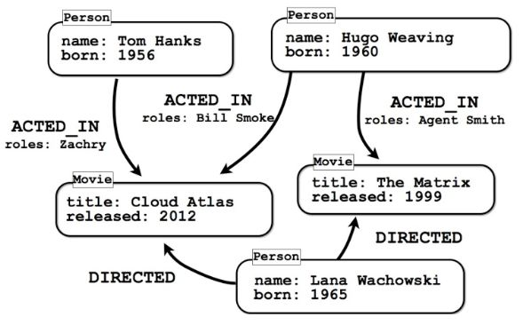


## Зв'язність графів

Графи діляться на;
- зв'язні
- незв'язні

У **зв'язного** графа між будь-якою парою вершин існує як мінімум один шлях.

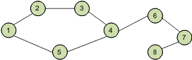

У **незв'язному** графі існує хоча б одна вершина, не пов'язана з іншими.

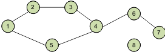

## Планарність

**Планарний граф** — граф, який може бути зображений на площині без перетину ребер.

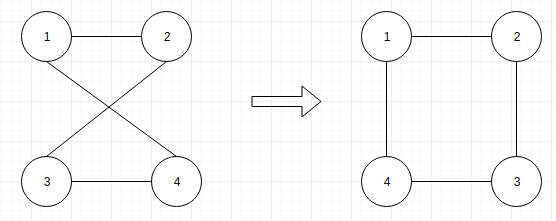

# Способи представлення графів

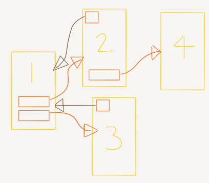

```cpp
struct Node
{
    ... payload ...
    Link *first_in, *last_in, *first_out, *last_out;
};

struct Link
{
    ... payload ...
    Node *from, *to;
    Link *prev_same_from, *next_same_from,
         *prev_same_to, *next_same_to;
};
```

## Матриця суміжності

**Матриця суміжності графа** - це квадратна матриця, в якій кожен елемент приймає одне з двох значень: 0 або 1.

Число рядків матриці суміжності дорівнює числу стовпців і відповідає кількості вершин графа.
- 0 - відповідає відсутності ребра,
- 1 - відповідає наявності ребра.

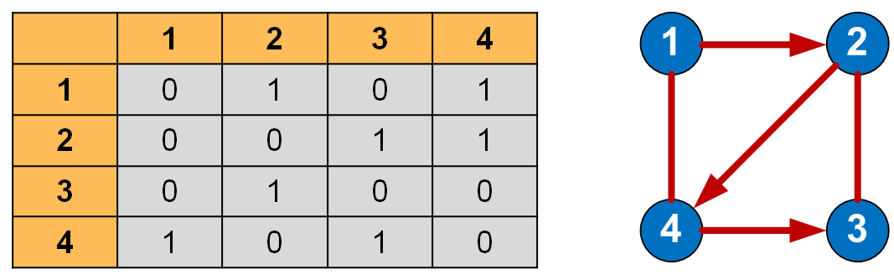

Всі елементи на головній діагоналі рівні 0 якщо граф не має петель.

## Матриця інцидентності

**Матриця інцидентності** (інціденцій) графа - це матриця, кількість рядків в якій відповідає числу вершин, а кількість стовпців - числу ребер. У ній вказуються зв'язку між інцидентними елементами графа (ребро (дуга) і вершина).

У неорієнтованому графі якщо вершина инцидентна ребру то відповідний елемент дорівнює 1, в іншому випадку елемент дорівнює 0.

В орієнтованому графі якщо ребро виходить з вершини, то відповідний елемент дорівнює 1, якщо ребро входить в вершину, то відповідний елемент дорівнює -1, якщо ребро відсутня, то елемент дорівнює 0.

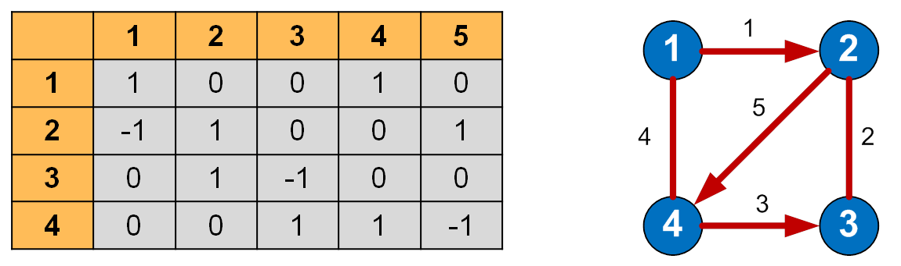

## Список суміжності (інцидентності)

Якщо кількість ребер графа в порівнянні з кількістю вершин невелика, то значення більшості елементів матриці суміжності дорівнюватимуть 0. При цьому використання даного методу недоцільно. Для подібних графів є більш оптимальні способи їх подання.

По відношенню до пам'яті списки суміжності менш вимогливі, ніж матриці суміжності. Такий список можна представити у вигляді таблиці, стовпців в якій - 2, а рядків - не більш, ніж вершин в графі.
У кожному рядку в першому стовпці вказана вершина виходу, а в другому стовпці - список вершин, в які входять ребра з поточної вершини.

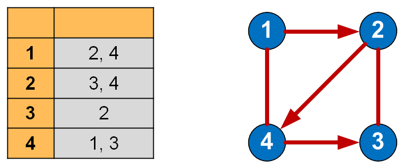

## Список ребер

У списку ребер в кожному рядку записуються дві суміжні вершини і вага з'єднує їх ребра (для зваженого графа).
Кількість рядків у списку ребер завжди має дорівнювати величині, що виходить в результаті складання орієнтованих ребер з подвоєною кількістю неорієнтованих ребер.

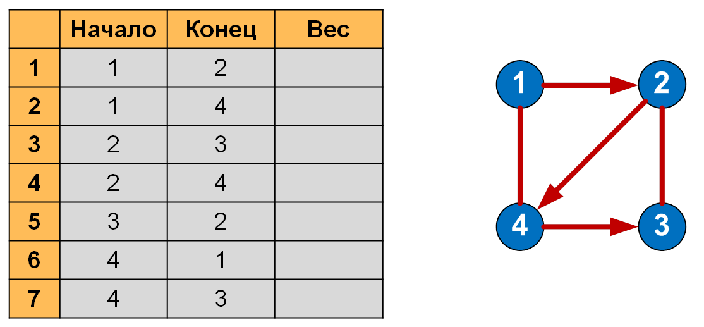

# Алгоритми на графах

## Обхід графів

**Обхід графа (пошук на графі)** - це процес систематичного перегляду всіх ребер або вершин графа з метою відшукання ребер або вершин, які відповідають деякому умові.

### Обхід в ширину

Пошук в ширину має на увазі поуровневого дослідження графа:
- спочатку відвідується корінь - довільно обраний вузол
- потім - всі нащадки даного вузла
- після цього відвідуються нащадки нащадків і т.д.

Вершини проглядаються в порядку зростання їх відстані від кореня.
Алгоритм припиняє свою роботу після обходу всіх вершин графа, або в разі виконання необхідного умови.

Кожна вершина може перебувати в одному з 3 станів:
- 0 - помаранчевий - невиявлення вершина;
- 1 - зелений - виявлена, але не відвідана вершина;
- 2 - сірий - оброблена вершина.

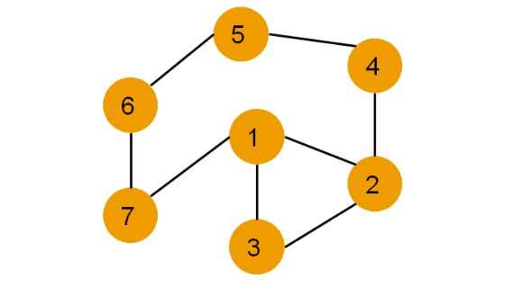

### Обхід в глибину

Пошук в ширину проводиться симетрично (вершини графа проглядалися за рівнями). Пошук в глибину передбачає просування вглиб до тих пір, поки це можливо. Неможливість просування означає, що наступним кроком буде перехід на останній, який має кілька варіантів руху (один з яких досліджений повністю), раніше відвіданий вузол (вершина).

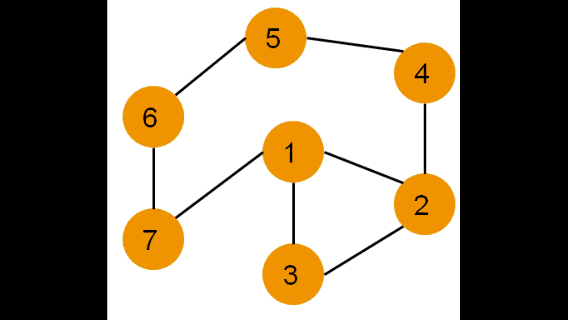

## Найкоротший шлях

**Задача про найкоротший шлях** - завдання пошуку найкоротшого шляху (ланцюга) між двома точками (вершинами) на графі, в якій мінімізується сума ваг ребер, що складають шлях.

**Зважений граф** - граф, кожному ребру якого поставлено у відповідність деяке значення (вага ребра).

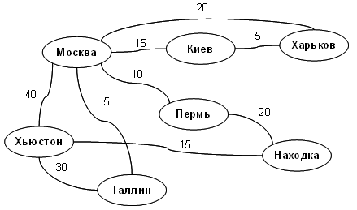

### Алгоритм Дейкстри

**алгоритм Дейкстри** - алгоритм на графах, винайдений нідерландським вченим Е. Дейкстрой в 1959 році. Знаходить найкоротшу відстань від однієї з вершин графа до всіх інших. Працює тільки для графів без ребер з негативними вагами.

# Домашнє завдання

## Варіанти

## Контрольні запитання

1. Що таке грфа?
2. Перечисліть і поясніть основні характеристики графів?
3. Як можна представляти графи?
4. Яка різниця між обходом в глибину і в ширину?
5. Поясніть алгоритм Дейкстри для пошуку найкоротшого шляху в графові?