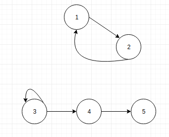

# Графи

# Зміст

${toc}

# Що таке граф?

**Граф** - сукупність точок, з'єднаних лініями. Точки називаються вершинами, або вузлами, а лінії - ребрами, або дугами.

- V - множина вершин
- E - множина ребер
- V: {1,2,3,4,5}
- E:{(1,2),(2,1),(3,3),(3,4),(4,5)}

# Де застосувуються графи?

- Маршрути

- Топологія мережі

- Соціальний граф

і т.д.

# Характеристики графів

Графи можуть характеризуватися наступними ознаками:
- Орієнтований / неорієнтований
- Наявність циклів
- Наявність петель
- Додаткова інформація
- Зв'язність
- Планарність

## Орієнтовані і неорієнтовані графи

Графи можуть бути **орієнтованими**, **неорієнтованимим** і **змішанимим**.

В **орієнтованому** графі ребра є спрямованими, тобто існує тільки однин доступний напрямок між двома зв'язковими вершинами.

У **неорієнтованому** графі по кожному з ребер можна здійснити перехід в обох напрямках.

Різниця між орієнтованим і неорієнтованим графом:

Окремий випадок двох цих видів - **змішаний граф**. Він характерний наявністю як орієнтованих, так і неорієнтовані ребер.

## Наявність циклів

Для того щоб розібратися із циклами в графах давайте введемо поняття шлях. **Шлях в графі** - це послідовність ребер, в якій кінець кожного ребра (крім останнього) збігається з початком наступного. Тоді, замкнутий шлях називається **циклом**.

## Наявність петель

Коли у ребра обидва кінці збігаються, тобто воно виходить з вершини і входить в неї, то таке ребро називається **петлею**.

## Зв'язність графів

Графи діляться на;
- зв'язні
- незв'язні

У **зв'язного** графа між будь-якою парою вершин існує як мінімум один шлях.

У **незв'язному** графі існує хоча б одна вершина, не пов'язана з іншими.

## Планарність

**Планарний граф** — граф, який може бути зображений на площині без перетину ребер.

# Способи представлення графів

## Матриця суміжності

## Список ідемпотентності

# Реалізація графа на C++

# Алгоритми на графах

## Обхід графів

## Найкоротший шлях

# Домашнє завдання

## Варіанти

## Контрольні запитання

1. Що таке грфа?
2. Перечисліть і поясніть основні характеристики графів?
3. Як можна представляти графи?
4. 