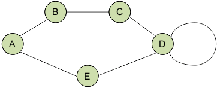
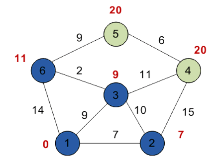
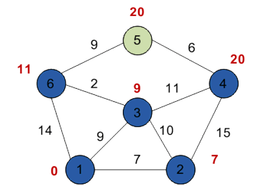

# Графи

# Зміст

${toc}

# Що таке граф?

**Граф** - сукупність точок, з'єднаних лініями. Точки називаються вершинами, або вузлами, а лінії - ребрами, або дугами.

- V - множина вершин
- E - множина ребер
- V: {1,2,3,4,5}
- E:{(1,2),(2,1),(3,3),(3,4),(4,5)}


# Де застосувуються графи?

- Маршрути


- Топологія мережі


- Соціальний граф


- В медицині


і т.д.

# Характеристики графів

Графи можуть характеризуватися наступними ознаками:
- Орієнтований / неорієнтований
- Наявність циклів
- Наявність петель
- Додаткова інформація
- Зв'язність
- Планарність

## Орієнтовані і неорієнтовані графи

Графи можуть бути **орієнтованими**, **неорієнтованимим** і **змішанимим**.

В **орієнтованому** графі ребра є спрямованими, тобто існує тільки однин доступний напрямок між двома зв'язковими вершинами.


У **неорієнтованому** графі по кожному з ребер можна здійснити перехід в обох напрямках.


Різниця між орієнтованим і неорієнтованим графом:


Окремий випадок двох цих видів - **змішаний граф**. Він характерний наявністю як орієнтованих, так і неорієнтовані ребер.

## Наявність циклів

Для того щоб розібратися із циклами в графах давайте введемо поняття шлях. **Шлях в графі** - це послідовність ребер, в якій кінець кожного ребра (крім останнього) збігається з початком наступного. Тоді, замкнутий шлях називається **циклом**.


## Наявність петель

Коли у ребра обидва кінці збігаються, тобто воно виходить з вершини і входить в неї, то таке ребро називається **петлею**.



## Додаткова інформація

Грфа в своїх вершинах може містити складні структури даних.


## Зв'язність графів

Графи діляться на;
- зв'язні
- незв'язні

У **зв'язного** графа між будь-якою парою вершин існує як мінімум один шлях.


У **незв'язному** графі існує хоча б одна вершина, не пов'язана з іншими.


## Планарність

**Планарний граф** — граф, який може бути зображений на площині без перетину ребер.


# Способи представлення графів


```cpp
struct Node
{
    ... payload ...
    Link *first_in, *last_in, *first_out, *last_out;
};

struct Link
{
    ... payload ...
    Node *from, *to;
    Link *prev_same_from, *next_same_from,
         *prev_same_to, *next_same_to;
};
```

## Матриця суміжності

**Матриця суміжності графа** - це квадратна матриця, в якій кожен елемент приймає одне з двох значень: 0 або 1.

Число рядків матриці суміжності дорівнює числу стовпців і відповідає кількості вершин графа.
- 0 - відповідає відсутності ребра,
- 1 - відповідає наявності ребра.


Всі елементи на головній діагоналі рівні 0 якщо граф не має петель.

## Матриця інцидентності

**Матриця інцидентності** (інціденцій) графа - це матриця, кількість рядків в якій відповідає числу вершин, а кількість стовпців - числу ребер. У ній вказуються зв'язку між інцидентними елементами графа (ребро (дуга) і вершина).

У неорієнтованому графі якщо вершина инцидентна ребру то відповідний елемент дорівнює 1, в іншому випадку елемент дорівнює 0.

В орієнтованому графі якщо ребро виходить з вершини, то відповідний елемент дорівнює 1, якщо ребро входить в вершину, то відповідний елемент дорівнює -1, якщо ребро відсутня, то елемент дорівнює 0.


## Список суміжності (інцидентності)

Якщо кількість ребер графа в порівнянні з кількістю вершин невелика, то значення більшості елементів матриці суміжності дорівнюватимуть 0. При цьому використання даного методу недоцільно. Для подібних графів є більш оптимальні способи їх подання.

По відношенню до пам'яті списки суміжності менш вимогливі, ніж матриці суміжності. Такий список можна представити у вигляді таблиці, стовпців в якій - 2, а рядків - не більш, ніж вершин в графі.
У кожному рядку в першому стовпці вказана вершина виходу, а в другому стовпці - список вершин, в які входять ребра з поточної вершини.


## Список ребер

У списку ребер в кожному рядку записуються дві суміжні вершини і вага з'єднує їх ребра (для зваженого графа).
Кількість рядків у списку ребер завжди має дорівнювати величині, що виходить в результаті складання орієнтованих ребер з подвоєною кількістю неорієнтованих ребер.


## Реалізація графа на C++, з використанням матриці інцидентності

```cpp
#include <iostream>

using namespace std;

bool A[10][10];

void initialize()
{
    for(int i = 0;i < 10;++i)
        for(int j = 0;j < 10;++j)
            A[i][j] = false;
}

int main()
{
    int x, y, nodes, edges;
    initialize();       //Since there is no edge initially
    cin >> nodes;       //Number of nodes
    cin >> edges;       //Number of edges
    for(int i = 0;i < edges;++i)
    {
        cin >> x >> y;
        A[x][y] = true;     //Mark the edges from vertex x to vertex y
    }
    if(A[3][4] == true)
        cout << “There is an edge between 3 and 4” << endl;
    else 
        cout << “There is no edge between 3 and 4” << endl;

    if(A[2][3] == true)
        cout << “There is an edge between 2 and 3” << endl;
    else 
        cout << “There is no edge between 2 and 3” << endl;

    return 0;
}
```


# Алгоритми на графах

## Обхід графів

**Обхід графа (пошук на графі)** - це процес систематичного перегляду всіх ребер або вершин графа з метою відшукання ребер або вершин, які відповідають деякому умові.

### Обхід в ширину

Пошук в ширину має на увазі поуровневого дослідження графа:
- спочатку відвідується корінь - довільно обраний вузол
- потім - всі нащадки даного вузла
- після цього відвідуються нащадки нащадків і т.д.

Вершини проглядаються в порядку зростання їх відстані від кореня.
Алгоритм припиняє свою роботу після обходу всіх вершин графа, або в разі виконання необхідного умови.

Кожна вершина може перебувати в одному з 3 станів:
- 0 - помаранчевий - невиявлення вершина;
- 1 - зелений - виявлена, але не відвідана вершина;
- 2 - сірий - оброблена вершина.


### Обхід в глибину

Пошук в ширину проводиться симетрично (вершини графа проглядалися за рівнями). Пошук в глибину передбачає просування вглиб до тих пір, поки це можливо. Неможливість просування означає, що наступним кроком буде перехід на останній, який має кілька варіантів руху (один з яких досліджений повністю), раніше відвіданий вузол (вершина).


## Найкоротший шлях

**Задача про найкоротший шлях** - завдання пошуку найкоротшого шляху (ланцюга) між двома точками (вершинами) на графі, в якій мінімізується сума ваг ребер, що складають шлях.

**Зважений граф** - граф, кожному ребру якого поставлено у відповідність деяке значення (вага ребра).


### Алгоритм Дейкстри

**алгоритм Дейкстри** - алгоритм на графах, винайдений нідерландським вченим Е. Дейкстрой в 1959 році. Знаходить найкоротшу відстань від однієї з вершин графа до всіх інших. Працює тільки для графів без ребер з негативними вагами.

Нехай потрібно знайти найкоротший відстані від 1-ї вершини до всіх інших.

Крожками позначені вершини, лініями - шляху між ними (ребра графа). У гуртках позначені номери вершин, над ребрами позначений їх вага - довжина шляху. Поряд з кожною вершиною червоним позначена мітка - довжина найкоротшого шляху в цю вершину з вершини 1.


#### Ініціалізація

Мітка самої вершини 1 покладається рівною 0, мітки інших вершин - недосяжно велике число (в ідеалі - нескінченність). Це відображає те, що відстані від вершини 1 до інших вершин поки невідомі. Всі вершини графа позначаються як невідвідані.


#### Перший крок

Мінімальну мітку має вершина 1. Її сусідами є вершини 2, 3 і 6. Обходимо сусідів вершини по черзі.

Перший сусід вершини 1 - вершина 2, тому що довжина шляху до неї мінімальна. Довжина шляху в неї через вершину 1 дорівнює сумі найкоротшої відстані до вершини 1, значенням її мітки, і довжини ребра, що йде з 1-й в 2-ю, тобто 0 + 7 = 7. Це менше поточної мітки вершини 2 (10000) , тому нова мітка 2-й вершини дорівнює 7.

Аналогічно знаходимо довжини шляху для всіх інших сусідів (вершини 3 і 6).


Всі сусіди вершини 1 перевірені. Поточне мінімальна відстань до вершини 1 вважається остаточним і перегляду не підлягає. Вершина 1 зазначається як відвідана.

#### Другий крок

Крок 1 алгоритму повторюється. Знову знаходимо «найближчу» з невідвіданих вершин. Це вершина 2 з міткою 7.

Знову намагаємося зменшити мітки сусідів обраної вершини, намагаючись пройти в них через 2-ю вершину. Сусідами вершини 2 є вершини 1, 3 і 4.

Вершина 1 вже переглянуло. Наступний сусід вершини 2 - вершина 3, так як має мінімальну позначку з вершин, позначених що не відвідані. Якщо йти в неї через 2, то довжина такого шляху буде дорівнює 17 (7 + 10 = 17). Але поточна мітка третьої вершини дорівнює 9, а 9 <17, тому мітка не змінюється.


Ще один сусід вершини 2 - вершина 4. Якщо йти в неї через 2-ю, то довжина такого шляху буде дорівнює 22 (7 + 15 = 22). Оскільки 22 <10000, встановлюємо мітку вершини 4 рівній 22.

Всі сусіди вершини 2 переглянуті, помічаємо її як відвідану.

#### Третій крок

Повторюємо крок алгоритму, вибравши вершину 3. Після її «обробки» отримаємо наступні результати.


#### Четвертий крок



#### П'ятий крок



#### Шостий крок


#### Рух по графу

Займемося висновком найкоротшого шляху. Ми знаємо довжину шляху для кожної вершини, і тепер будемо розглядати вершини з кінця. Розглядаємо кінцеву вершину (в даному випадку - вершина 5), і для всіх вершин, з якою вона пов'язана, знаходимо довжину шляху, віднімаючи вагу відповідного ребра з довжини шляху кінцевої вершини.

- Так, вершина 5 має довжину шляху 20. Вона пов'язана з вершинами 6 і 4.
- Для вершини 6 отримаємо вагу 20 - 9 = 11 (збігся).
- Для вершини 4 отримаємо вагу 20 - 6 = 14 (не співпали).

Якщо в результаті ми отримаємо значення, яке збігається з довжиною шляху розглянутої вершини (в даному випадку - вершина 6), то саме з неї був здійснений перехід в кінцеву вершину. Відзначаємо цю вершину на шуканому шляху.

Далі визначаємо ребро, через яке ми потрапили в вершину 6. І так поки не дійдемо до початку.

Якщо в результаті такого обходу у нас на якомусь етапі співпадуть значення для декількох вершин, то можна взяти будь-яку з них - кілька шляхів матимуть однакову довжину.

Таким чином, найкоротшим шляхом з вершини 1 у вершину 5 буде шлях через вершини 1 - 3 - 6 - 5, оскільки таким шляхом ми набираємо мінімальна вага, рівний 20.

# Домашнє завдання

Реалізуйте алгоритм обхіду графа в глибину або в ширину.

## Контрольні запитання

1. Що таке грфа?
2. Перечисліть і поясніть основні характеристики графів?
3. Як можна представляти графи?
4. Яка різниця між обходом в глибину і в ширину?
5. Поясніть алгоритм Дейкстри для пошуку найкоротшого шляху в графові?