# Дерева

# Зміст

${toc}

# Структура даних дерево

**Дерево** - одна з найбільш широко поширених структур даних в інформатиці, емулююча деревоподібну структуру у вигляді набору пов'язаних вузлів. Є зв'язаним графом, що не містить цикли. Більшість джерел також додають умова на те, що ребра графа не повинні бути орієнтованими. На додаток до цих трьох обмеженням, в деяких джерелах вказується, що ребра графа не повинні бути зваженими.

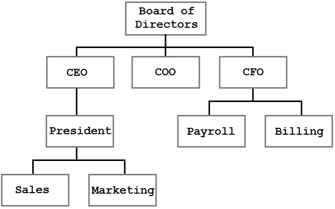

## Визначення в деревах


- Кореневий вузол - самий верхній вузол дерева (вузол 8 на прикладі).
- Корінь - одна з вершин, за бажанням спостерігача.
- Лист, листовий або термінальний вузол - вузол, який не має дочірніх елементів (вузли 1, 4, 7, 13).
- Внутрішній вузол - будь-який вузол дерева, що має нащадків, і таким чином, не є листовим вузлом (3, 6, 10, 14)

# Представлення дерева в пам'яті

## Список батьків

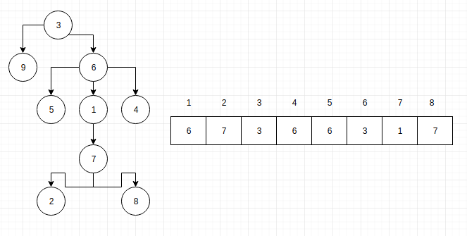

## Ієрархія об'єктів

Структура бінарного дерева складається з вузлів. Як і у зв'язаному списку, ці вузли містять поля даних і покажчики на інші вузли в колекції. У цьому розділі ми визначимо вузли дерева і операції для його побудови і проходження. Оголосимо клас TreeNode, який реалізує функціональність вузла дерева, і розробимо ряд функцій, що дозволяють створювати бінарні дерева і здійснювати проходження по їх вузлів.

Вузол дерева містить поле даних і два поля з покажчиками. Поля покажчиків називаються лівим покажчиком (left) і правим покажчиком (right), оскільки вони вказують на ліве і праве піддерево, відповідно. Значення NULL є ознакою порожнього дерева.

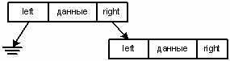


# Бінарне дерево пошуку

Бінарне дерево пошуку будується за певними правилами:
- У кожного вузла не більше двох дітей.
- Будь-яке значення менше значення вузла стає лівою дитиною або дитиною лівого дитини.
- Будь-яке значення більше або дорівнює значенню вузла стає правою дитиною або дитиною правої дитини.

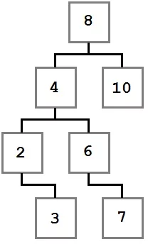

Зверніть увагу, як зазначені обмеження впливають на структуру дерева. Кожне значення зліва від кореня (8) менше восьми, кожне значення праворуч - більше або дорівнює кореню. Це правило застосовується до будь-якого вузла дерева.

## Пошук в бінарному дереві

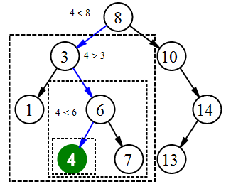

```py
Node search(x : Node, k : T):
   if x == null or k == x.key
      return x
   if k < x.key
      return search(x.left, k)
   else
      return search(x.right, k)
```

## Пошук мінімального і максимального значення

Щоб знайти мінімальний елемент в бінарному дереві пошуку, необхідно просто дотримуватися left від кореня дерева, поки не зустрінеться значення null. Якщо у вершини є ліве піддерево, то за властивістю бінарного дерева пошуку в ньому зберігаються всі елементи з меншим ключем. Якщо його немає, значить ця вершина і є мінімальна. Аналогічно шукається і максимальний елемент. Для цього потрібно слідувати правим вказівниками.

```py
Node minimum(x : Node):
  if x.left == null
     return x
  return minimum(x.left)
```

```py
Node maximum(x : Node):
  if x.right == null
     return x
  return maximum(x.right)
```

Дані функції приймають корінь поддерева, і повертають мінімальний (максимальний) елемент в поддереве. Обидві процедури виконуються за час O(h).

## Додавання вузла

Додавання вузла не представляє особливої ​​складності. Воно стає ще простіше, якщо вирішувати цю задачу рекурсивно. Є всього два випадки, які треба врахувати:
- Дерево пусте

Якщо дерево порожнє, ми просто створюємо новий вузол і додаємо його в дерево.

- Дерево не пусте

 У другому випадку ми порівнюємо передане значення зі значенням в вузлі, починаючи від кореня. Якщо додається значення менше значення даного вузла, повторюємо ту ж процедуру для лівого піддерева. В іншому випадку - для правого.


## Видалення вузла

Для видалення вузла з бінарного дерева пошуку потрібно розглянути три можливі ситуації:

- Якщо у вузла немає дочірніх вузлів, то у його батька потрібно просто замінити покажчик на null

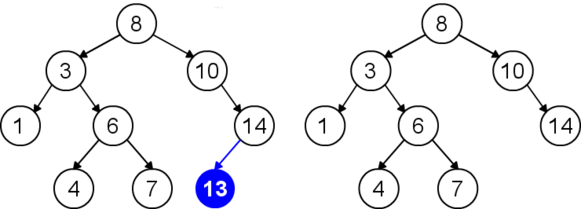

- Якщо у вузла є тільки один дочірній вузол, то потрібно створити новий зв'язок між батьком видаляється вузла і його дочірнім вузлом.

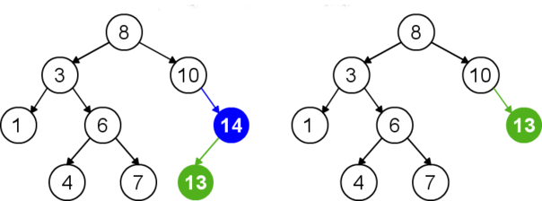

- якщо у вузла два дочірніх вузла, то потрібно знайти наступний за ним елемент (у цього елемента не буде лівого нащадка), його правого нащадка підвісити на місце знайденого елемента, а видаляється вузол замінити знайденим вузлом.

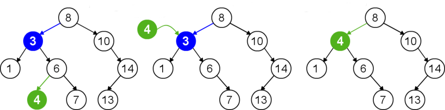

## Асиимптотичні складності бінарного дерева пошуку

||Мередній|Найгірший|
|-|-|
|Пошук|$O(logn)$|$n$|
|Вставка|$O(logn)$|$n$|
|Видалення|$O(logn)$|$n$|

## Необхідність балансування дерева

Збалансоване бінарне дерево пошуку застосовується, коли необхідно здійснювати швидкий пошук елементів, що чергується зі вставками нових елементів і вилученнями існуючих. У разі, якщо набір елементів, що зберігається в структурі даних фіксований і немає нових вставок і вилучень, то масив краще. Тому що пошук можна здійснювати алгоритмом бінарного пошуку за той же логарифмічна час, але відсутні додаткові витрати по зберіганню і використанню покажчиків.

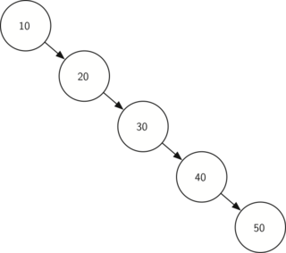

Користі від такого дерева - зовсім небагато. В даному випадку, нам потрібна структура, яка в разі додавання елементів - буде балансувати сама себе, але при цьому зберігати вид двійкового дерева пошуку.


# АВЛ - дерева

**АВЛ-дерево** (англ. AVL-Tree) - збалансоване бінарне дерево пошуку, в якому підтримується наступне властивість: для кожної його вершини висота її двох піддерев відрізняється не більше ніж на 1.

АВЛ-дерева названі за першими літерами прізвищ їх винахідників, Г. М. Адельсона-Бєльського і Е. М. Ландіса, які вперше запропонували використовувати АВЛ-дерева в 1962 році.


## Методи балансування

У разі, якщо при додаванні відбувається розбалансування, тобто фактор балансу деяких вузлів == 2, використовуються так звані повороти навколо вузлів. наприклад:

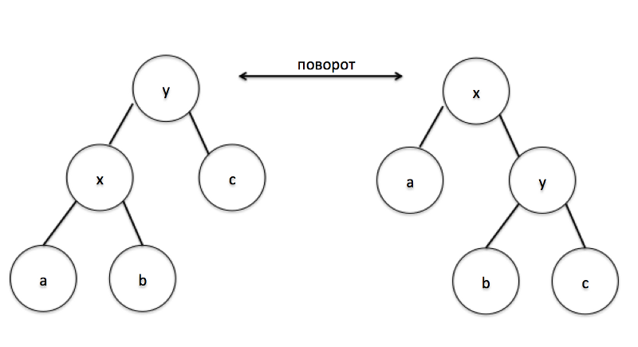

Отже, розглянемо ситуацію, коли висота правого піддерева на 2 більше ніж лівого:

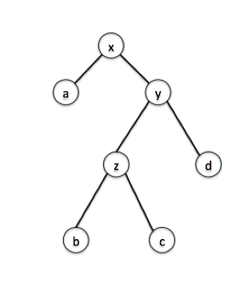

в цьому випадку $h(a) - h(y) = 2$

Для того щоб вирішити дану проблему дисбалансу, у нас є вибір. Або зробити просто поворот вліво навколо вузла x, або великий поворот вліво навколо того самого x.

Простий поворот використовується якщо висота лівого піддерева вузла менше або дорівнює ніж висота правого, тобто в нашому випадку $h(z) <= h(d)$:

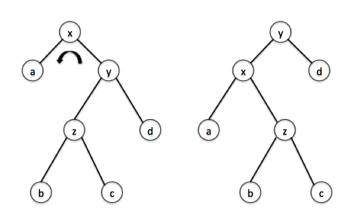

Великий поворот виконується коли висота лівого піддерева більше ніж висота правого $h(z)> h(d)$. Складається він з двох поворотів: правий навколо вузла y і лівий навколо x:

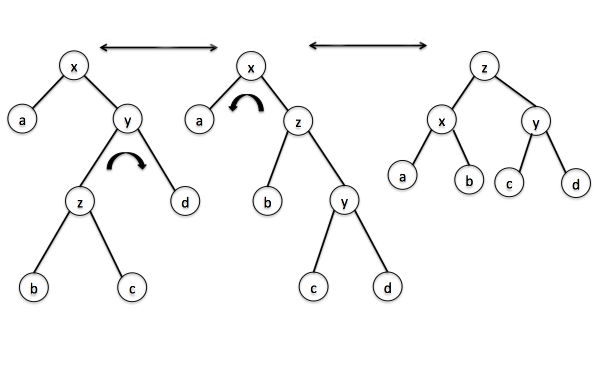

# Красно - чорні збалансовані делева

Червоно-чорні дерева відносяться до збалансованих дерев пошуку.

Властивості красно - чорних дерев:
1. Кожен вузол забарвлений або в червоний, або в чорний колір (в структурі даних вузла з'являється додаткове поле - біт кольору).
2. Корінь забарвлений в чорний колір.
3. Листя (так звані NULL-вузли) пофарбовані в чорний колір.
4. Кожен червоний вузол повинен мати два чорних дочірніх вузла. Потрібно відзначити, що у чорного вузла можуть бути чорні дочірні вузли. Червоні вузли в якості дочірніх можуть мати тільки чорні.
5. Шляхи від вузла до його листя повинні містити однакову кількість чорних вузлів (це чорна висота).

## Чому красно чорне дерево є збалансованим

Дійсно, червоно-чорні дерева не гарантують суворої збалансованості (різниця висот двох піддерев будь-якого вузла не повинна перевищувати 1), як в АВЛ-дерева. Але дотримання властивостей червоно-чорного дерева дозволяє забезпечити виконання операцій вставки, видалення і вибірки за час $O(logN)$. І зараз подивимося, чи дійсно це так.

Нехай у нас є червоно-чорне дерево. Чорна висота дорівнює bh(black height).

Якщо шлях від кореневого вузла до листового містить мінімальну кількість червоних вузлів (тобто нуль), значить цей шлях дорівнює bh.

Якщо ж шлях містить максимальну кількість червоних вузлів (bh відповідно до властивісті 4), то цей шлях буде дорівнює 2bh.

Тобто, шляхи з кореня до листя можуть відрізнятися не більше, ніж удвічі ($h <= 2log(N+1)$, де h - висота піддерева), цього достатньо, щоб час виконання операцій в такому дереві було $O(logN)$

## Асимптотичні складності красно - чорного збалансованого дерева

||Мередній|Найгірший|
|-|-|
|Пошук|$O(logn)$|$O(logn)$|
|Вставка|$O(logn)$|$O(logn)$|
|Видалення|$O(logn)$|$O(logn)$|

## Де використовуються красно - чорні сбалансовані дерева

- Java: java.util.TreeMap ,java.util.TreeSet.
- C++ STL: map, multimap, multiset.
- Linux kernel: completely fair scheduler, linux/rbtree.h

# АВЛ vs Красно - чорні збалансовані дерева

Так як в ідеально збалансованому дереві багато ресурсів витрачається на підтримання збалансованості, рекомендується використовувати його в ситуації, коли вставка / видалення відбувається значно рідше зчитування. Червоно-чорні дерева, навпаки, витрачають менше ресурсів на підтримку збалансованості (хоча тут теж є перебалансировка), і їх краще використовувати, коли вставка і читання відбуватимуться приблизно з однаковою частотою.

# Домашнє завдання

## Варіанти

# Контрольні запитання

1. Що таке дерева?
2. Що таке бінарні дерева пошуку?
3. Навіщо потрібно тримати бінарне дерево пошуку збалансованим?
4. Що таке АВЛ - дерева?
5. Що таке красно чорні збалансовані дерева?
