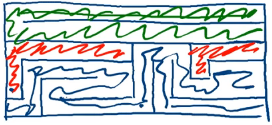
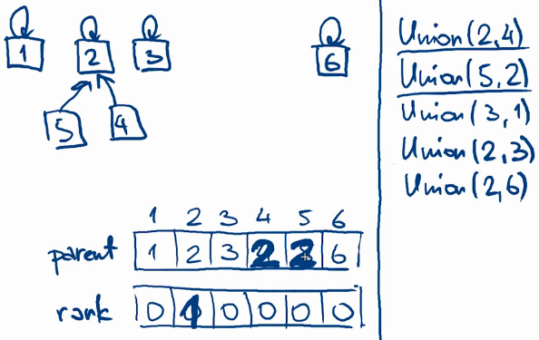
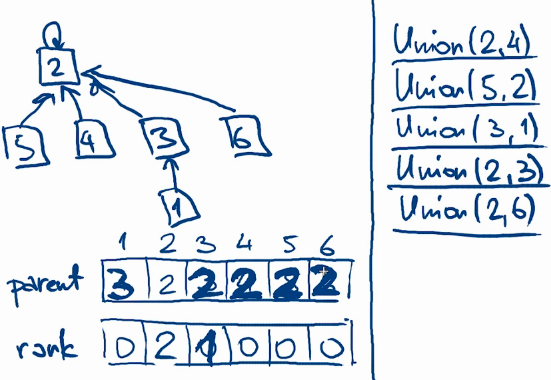

# Системи непересічних множин

${toc}

# Множина як тип даних

Множина - тип і структура даних в інформатиці, яка є реалізацією математичного об'єкта множина. Дані типу множини дозволяють зберігати обмежене число значень певного типу без певного порядку. Повторення значень, як правило, неприпустимо.


# Системи непересічних множин

Системи непересічних множин дають наступні можливості:
- Спочатку є кілька елементів, кожен з яких знаходиться в окремомій (своєму власному) множині.
- За одну операцію можна об'єднати дві будь-яких множини, а також можна запросити, в якій множині зараз знаходиться зазначений елемент.
- Також, в класичному варіанті, вводиться ще одна операція - створення нового елемента, який поміщається в окрему множину.

Таким чином, базовий інтерфейс даної структури даних складається всього з трьох операцій:
- make_set(x) - додає новий елемент x, поміщаючи його в нову множину, що складається з одного нього.
- union_sets(x, y) - об'єднує дві множини (множина, в якій знаходиться елемент x, і множина, в якій знаходиться елемент y).
- find_set(x) - повертає, в якій множині знаходиться зазначений елемент x. Насправді при цьому повертається один з елементів множини (званий представником або лідером. Цей представник вибирається в кожній множині, самою структурою даних (і може змінюватися з плином часу, а саме, після викликів union_sets()).

Приклад роботи такої гіпотетичної структури:


# Прикладне застосування систем непересічних множин

## Генерація лабіринта

Завдання: згенерувати лабіринт з одним входом і одним виходом.

Алгоритм рішення:
Почнемо з стану, коли встановлені всі стіни, за винятком входу і виходу.
На кожному кроці алгоритму виберемо випадкову стіну. Якщо осередки, між якими вона стоїть, ще не пов'язані (лежать в різних компонентах DSU), то знищуємо її (зливаємо компоненти).
Продовжуємо процес до деякого стану збіжності: наприклад, коли вхід і вихід з'єднані; або, коли залишилася одна компонента.



## Мережа комп'ютерів


# Базові реалізації

## Мінімальний елемент

Вхідні дані: {9,3,2,4,7} {5} {6,1,8}

Зберігаєм в масивові:


### Реалізація інтерфейса

**MakeSet(i)**:
```
MakeSet(i):
    smallest[i]:=i
```

Асимптотична складність: $O(1)$

**Find(i)**:
```
Find(i):
    return smallest[i]
```

Асимптотична складність: $O(1)$

**Union(i,j)**:
```
Union(i,j):
    i_id:=Find(i)
    j_id:=Find(j)
    if i_id = j_id:
        return
    m:=min(i_id, j_id)
    for k from 1 to n:
        if smallest[k] in {i_id,j_id}
        smallest[k]:=m
```

Асимптотична складність: $O(n)$

## Реалізація із використанням списку


Асимптотична складність Find: $O(n)$


# Реалізація непересічних множин у вигляді корневих дерев


## Реалізація інтерфейсу

**MakeSet**:
```
MakeSet(i):
    parent[i]:=i
```

Асимптотична складність: $O(1)$

**Find**:
```
Find(i):
    while i != parent[i]:
        i:=parent[i]
    return i
```

Асимптотична складність: $O(h)$, де h - висота дерева

## Зливання множин


**Union(i,j)**
```cpp
Union(i,j):
    i_id:=Find(i)
    j_if:=Find(j)
    if i_id=j_id:
        return
    if rank[i_id]>rank[j_id]:
        parent[j_id]:=i_id
    else:
        parent[i_id]:=j_id:
            rank[j_id] += 1
```

### Приклад







Асимптотична складність роботи таких операцій Union і Find: $O(logn)$

## Скорочення шляхів


**Find(i)**
```cpp
Find(i):
    if i != parent[i]:
        parent[i]:=Find(parent[i])
    return parent[i]
```

# Висновки

- Реалізуємо DSU як дерева
- Представник множини - корінь
- Зливання по - рангу
- Скорочення шляхів
- Практично константний час. Амортизований час $O(logn)$

# Домашнє завдання

Реалізуйте структуру даних - непересічна множина.

# Контрольні запитання

1. Що таке системи непересічних множин?
2. Що таке "представник" в системі непересічних множин
3. Поясніть реалізацію системи непересічних множин з використанням корневих дерев.


