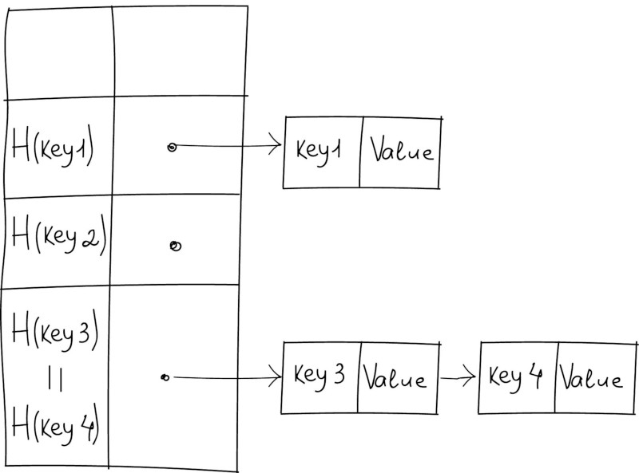
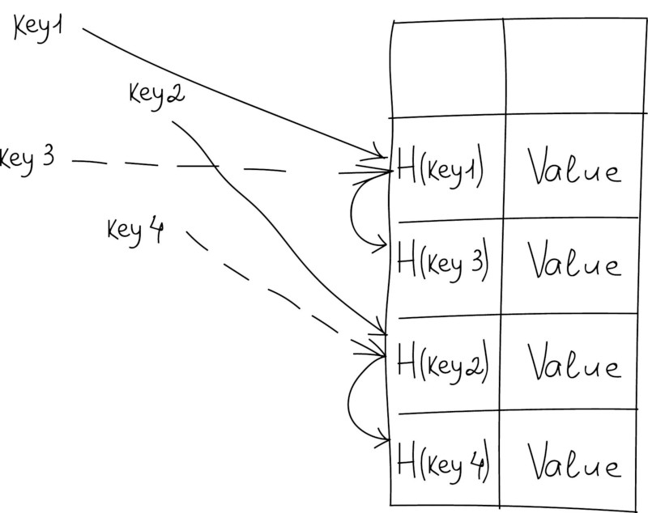

# Хеш - таблиця

# Зміст

${toc}

# Що таке хеш - таблиця

**Хеш-таблиця (hash table)** - це спеціальна структура даних для зберігання пар ключів і їх значень. По суті це асоціативний масив, в якому ключ представлений у вигляді хеш-функції.

Мабуть, головна властивість hash-таблиць - всі три операції вставка, пошук і видалення в середньому виконуються за час O(1), середній час пошуку по ній також O(1) і O(n) в гіршому випадку.

Щоб розібратися, що таке хеш-таблиці, уявіть, що вас попросили створити бібліотеку і заповнити її книгами. Але ви не хочете заповнювати шафи в довільному порядку.

Перше, що спадає на думку - розмістити всі книги в алфавітному порядку і записати все в якийсь довідник. В цьому випадку не доведеться шукати потрібну книгу по всій бібліотеці, а тільки за довідником.

А можна зробити ще зручніше. Якщо спочатку відштовхуватися від назви книги або імені автора, то краще використовувати якийсь алгоритм хешування, який обробляє значення і видає номер шафи і полиці для потрібної книги.

Знаючи цей алгоритм хешування, ви швидко знайдете потрібну книгу по її назві.

## Приклад із футбольною командою

**Дано**: Інформація про футбольну команду(номер, ім'я)

**Потрібно**: Мати змогу за константий час знайти ім'я гравця по номеру, додавати і видаляти гравців.


## Приклад із ip - адресою

**Дано**: внутрішню корпоративну адресу(множину ipv4 адрес)

**Потрібно**: Мати змогу вказати/дізнатися, що певний ip - адресс активний/неактивний за константний час.


## Приклад із словами


У прикладі на зображенні позиція кожного слова в хеш-таблиці залежить від порядкового номера першої літери цього слова в англійському алфавіті. По суті вона зіставляє ключі індексам масиву. Наприклад, на зображенні вище ми бачимо, що хеш-функція зіставили ключ 'banana' з індексом 1.

# Хешування. Хеш - функція. Вимоги до хеш - функцій. Колізії

**Хеш-функція** (англ. Hash function від hash - «перетворювати в фарш», «мішанина»), або функція згортки, - функція, що здійснює перетворення масиву вхідних даних довільної довжини в (вихідний) бітовий рядок встановленої довжини, що виконується певним алгоритмом. Перетворення, вироблене хеш-функцією, називається хешуванням.

Хеш - функція повинна мати такі властивості:
- Завжди повертати одинц і ту ж адресу для одного і того ж ключа;
- Не обов'язково повертає різні адреси для різних ключів;
- Використовує всі адресний простір з однаковою ймовірністю;
- Швидко обчислювати адреса.

Хешування корисно, коли широкий діапазон можливих значень повинен бути збережений в малому обсязі пам'яті, і потрібен спосіб швидкого, практично довільного доступу. Хеш-таблиці часто застосовуються в базах даних, і, особливо, в мовних процесорах типу компіляторів і ассемблеров, де вони витончено обслуговують таблиці ідентифікаторів. У таких додатках, таблиця - найкраща структура даних.

**Колізією** для функції h називається пара значень $x, y, x ≠ y$, така, що $h(x) = h(y)$.

**Якщо кількість елементів n(кількість ключів, які очікуються) більше m(розмір таблиці), то колізій уникнути неможна.**


## Приклади хеш - функцій

Деякі стандартні хеш - функцій. Якщо хеш-функція розподіляє сукупність можливих ключів рівномірно по безлічі індексів, то хешування ефективно розбиває безліч ключів. Найгірший випадок - коли всі ключі хешуються в один індекс. При цьому ми працюємо з одним лінійним списком, який і змушені послідовно сканувати кожен раз, коли що-небудь робимо. Звідси видно, як важлива хороша хеш-функція.

### Хешування інтервалів

Нехай дано числв в інтервалі K = [0,1). Тоді можна використати наступну хеш - функцію:
$floor(mod(k * m))$

```cpp
#include <cmath>
#include <iostream>

using  namespace std;

int get_hash(float key, int m){
    return (int)(key * m);
}

int main (int argc, char *argv[])
{
    float keys[] = {0.1, 0.01,0.2, 0.55, 0.8};
    int m = 3;

    for(float key : keys){
        std::cout << get_hash(key, m) << endl;
    }

    return 0;
}
```


### Ділення

Ділення (розмір таблиці hashTableSize - просте число). Хеш значення hashValue, змінюється від 0 до (hashTableSize - 1), дорівнює залишку від ділення ключа на розмір хеш-таблиці.

```cpp
#include <cmath>
#include <iostream>

using  namespace std;

int get_hash(int key, int m){
    return key % m;
}

int main (int argc, char *argv[])
{
    int keys[] = {12, 1, 100, 50, 100};
    int m = 3;

    for(int key : keys){
        std::cout << get_hash(key, m) << endl;
    }

    return 0;
}
```


### Адитивний метод для строк перемінної довжини

(Розмір таблиці дорівнює 256). Для рядків змінної довжини цілком розумні результати дає додавання по модулю 256. У цьому випадку результат hashValue укладений між 0 і 255.

```cpp
#include <cmath>
#include <iostream>

typedef unsigned char HashIndexType;

using  namespace std;

int get_hash(char *str){
    HashIndexType h = 0;
    while (*str) h += *str++;
    return h;
}

int main (int argc, char *argv[])
{
    cout << get_hash("john") << endl;
    cout << get_hash("sarah") << endl;
    cout << get_hash("marry") << endl;

    return 0;
}
```


# Методи вирішення колізій

## Метод ланцюгів

Цей метод часто називають відкритим хешуванням. Його суть проста - елементи з однаковим хешем потрапляють в одну клітинку у вигляді зв'язного списку.

Тобто, якщо клітинка з хешем вже зайнята, але новий ключ відрізняється від уже наявного, то новий елемент вставляється в список у вигляді пари ключ-значення.



Якщо обраний метод ланцюгів, то вставка нового елемента відбувається за O(1), а час пошуку залежить від довжини списку і в гіршому випадку дорівнює O (n).

У C ++ метод ланцюжків реалізується так:

```cpp
class LinkedHashEntry {
private:
      int key;
      int value;
      LinkedHashEntry *next;
public:
      LinkedHashEntry(int key, int value) {
            this->key = key;
            this->value = value;
            this->next = NULL;
      }
 
      int getKey() {
            return key;
      }
 
      int getValue() {
            return value;
      }
 
      void setValue(int value) {
            this->value = value;
      }
 
      LinkedHashEntry *getNext() {
            return next;
      }
 
      void setNext(LinkedHashEntry *next) {
            this->next = next;
      }
};
```

## Відкрита індексація(закрите хешування)

Другий поширений метод - відкрита індексація. Це означає, що пари ключ-значення зберігаються безпосередньо в хеш-таблиці. А алгоритм вставки перевіряє осередки в деякому порядку, поки не буде знайдена порожня клітинка. Порядок обчислюється на льоту.



### Послідовний пошук

При спробі додати елемент в зайняту комірку $i$ починаємо послідовно переглядати комірки $i + 1, i + 2, i + 3$ і так далі, поки не знайдемо вільну комірку. У неї і запишемо елемент.

### Лінійний пошук

Вибираємо крок $q$. При спробі додати елемент в зайняту комірку $i$ починаємо послідовно переглядати осередки $i + (1⋅q), i + (2⋅q), i + (3⋅q)$ і так далі, поки не знайдемо вільну комірку. У неї і запишемо елемент. По суті послідовний пошук - окремий випадок лінійного, де $q = 1$.

### Квадратичний пошук

Крок q не фіксований, а змінюється квадратично: $q = 1,4,9,16$ .... Відповідно при спробі додати елемент в зайняту комірку $i$ починаємо послідовно переглядати осередки $i + 1, i + 4, i + 9$ і так далі, поки не знайдемо вільну комірку.

# std::map

std :: map - це стандартна реалізація словника для С ++. Вона містить пари ключ-значення.

```cpp
std::map<int, std::string> stringLookupTable;
std::map<std::string, int> passwordHashForUser;

stringLookupTable[0] = std::string("John Doe");

string somename = stringLookupTable[0];

stringLookupTable.erase(0);
```

# Домашнє завдання 

Розробіть хеш - таблицю використовуючи метод ланцюгів.